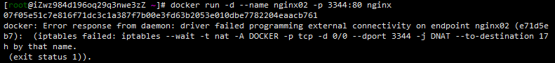

Docker端口映射或启动容器时报错：docker: Error response from daemon: driver failed programming external connectivity on endpoint nginx02 (e71d5ecb7): 

### 一、启动容器报错：

```shell
[root@iZwz984d196oq29q3nwe3zZ ~]# docker run -d --name nginx02 -p 3344:80 nginx
07f05e51c7e816f71dc3c1a387f7b00e3fd63b2053e010dbe7782204eaacb761
docker: Error response from daemon: driver failed programming external connectivity on endpoint nginx02 (e71d5ecb7):  (iptables failed: iptables --wait -t nat -A DOCKER -p tcp -d 0/0 --dport 3344 -j DNAT --to-destination 172h by that name.
 (exit status 1)).
```



### 二、原因

docker服务启动时定义的自定义链DOCKER由于某种原因被清掉
重启docker服务及可重新生成自定义链DOCKER

### 三、**解决:**

重启docker服务后再重新启动容器，即可成功

```shell
systemctl restart docker
docker start nginx02
```


> 参考：
>
> [北极之光-Docker端口映射或启动容器时报错-cnblog](https://www.cnblogs.com/hailun1987/p/7518306.html)