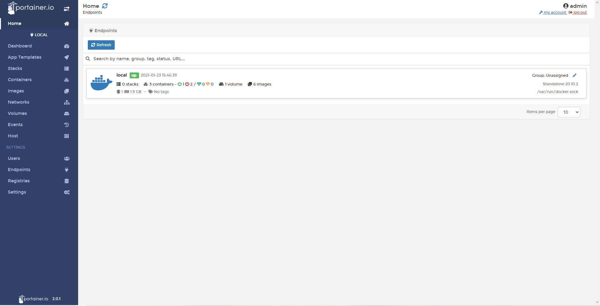
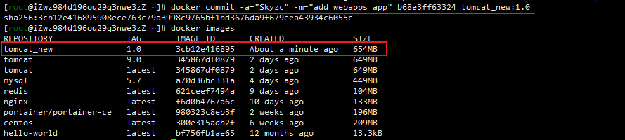

> 【狂神说Java】Docker最新超详细版教程通俗易懂https://www.bilibili.com/video/BV1og4y1q7M4

## Docker 的常用命令

### 实操案例

> 案例2：docker 装一个 Tomcat

```shell
# 官方的使用
docker run -it --rm tomcat:9.0

# 我们之前的启动都是后台，停止了容器之后，容器还可以查到
# docker run -it --rm 用完即删除，一般用于测试
```

```shell
# 拉取镜像
docker pull tomcat:9.0

# 查看镜像
docker images

# 运行镜像
docker run -d -p 3355:8080 --name tomcat01 tomcat

# 测试访问没有问题，但是显示 404 ,说明这个 Tomcat 并非完整的

# 一探究竟，进入 Tomcat01 容器查看
docker exec -it tomcat01 /bin/bash
# 发现问题：1、Linux命令少了 2、没有 webapps  
# 发现的确是被阉割版本的 Tomcat
# 这是阿里云镜像的原因，默认是最小镜像，所有不必要的都剔除掉。
# 保证是最小可运行环境
#
# 但是他的 webapps.dist 是可用的，可以将webapps.dist里面的内容移动到webapps里面去，# #（或者直接将 webapps.dist 改名为 webapps ）
# cp -r ./webapps.dist/* ./webapps
```

思考问题：我们以后要部署项目，如果每次都要进入容器就很麻烦。有没有解决方法？

我们要是在容器外部提供一个映射路径，webapps，然后我们在外部放置项目，就自动同步到内部就好了！

> 案例3：部署 es + kibana

```shell
# es 暴露的端口很多
# es 十分的耗内存
# es 的数据一般需要放置到安全目录！挂载

# 官方示例：
# docker run -d --name elasticsearch --net somenetwork -p 9200:9200 -p 9300:9300 -e "discovery.type=single-node" elasticsearch:tag
# --net somenetwork ？ 网络配置，可暂时不用
# 末尾的 tag 表示版本

# 下载并运行
docker run -d --name elasticsearch -p 9200:9200 -p 9300:9300 -e "discovery.type=single-node" elasticsearch:7.6.2

# 可以发现由于 es 非常耗费性能，（1G）已启动Linux服务器都会卡住
# docker stats 查看 cpu 占用情况
# 关闭 es 增加内存限制，修改配置文件 -e 环境配置修改

docker run -d --name elasticsearch -p 9200:9200 -p 9300:9300 -e "discovery.type=single-node" -e ES_JAVA_OPTS="-Xms64m -Xmx512m" elasticsearch:7.6.2
```

作业：使用 kibana 连接 es，该如何连接？


### 可视化

- portainer (先用这个)

  ```shell
  docker run -d -p 8088:9000 --restart=always -v /var/run/docker.sock:/var/run/docker.sock --privileged=true portainer/portainer-ce
  ```

- Rancher (CI/CD 再用)

**什么是 portainer ?**

Docker 图形化界面管理工具！提供一个后台管理面板供我们操作！

```shell
# -v 表示挂载
docker run -d -p 8088:9000 --restart=always -v /var/run/docker.sock:/var/run/docker.sock --privileged=true portainer/portainer-ce
```

启动之后，访问 ip:8088 即可

（第一次需要加载配置，需要等待一会儿）


需要我们自己设置密码，登录后即可看到：


选择 Docker 后进入主页，即可查看Docker信息：




## Docker 镜像讲解

### 镜像是什么

镜像是一种轻量级、可执行的独立软件包，用来打包软件运行环境和基于运行环境开发的软件，他包含运行某个软件所需的所有内容，包括代码、运行时、库、环境变量和配置文件。

所有的应用，直接打包 Docker 镜像，就可以直接跑起来。

如何得到镜像：

- 从远程仓库下载
- 别的地方拷贝
- 自己制作一个镜像 DockerFile

### Docker 镜像加载原理

> UnionFS （联合文件系统）

UnionFS （联合文件系统）：Union文件系统是一种分层、轻量级并且高性能的文件系统，它支持对文件系统的修改作为一次提交来一层层叠加，同时可以将不同目录挂载到同一虚拟文件系统下。Union文件系统是 Docker 镜像的基础。镜像可以通过分层来进行继承，基于基础镜像（没有父镜像），可以制作各种具体的应用镜像。

**特性：**一次同时加载多个文件系统，但从外面看起来，只能看见一个文件系统，联合加载会把各层文件系统叠加起来，这样最终的文件系统会包含所有底层的文件和目录。

> Docker 镜像加载原理

Docker 的镜像实际上由一层一层的文件系统组成，这种层级的文件系统就是UnionFS。

bootfs (boot file system) 主要包含 bootloader和 kernel。bootloader 主要是引导加载 kernel，Linux 刚启动时会加载 bootfs 文件系统，在 Docker 镜像的最底层是 bootfs。这一层与我们典型的Linux/Unix系统是一样的，包含bootloader 和内核。当 boot 加载完成之后整个内核就都在内存中了，此时内存的使用权已经由bootfs 转交给内核，此时系统也会卸载 bootfs。

rootfs (root file system) 在 bootfs 之上。包含的就是典型Linux系统中的 /dev,/proc./bin/etc/等标准目录和文件。rootfs就是各种不同的操作系统发行版，比如 Ubuntu ， Centos 等等。


平时我们安装进虚拟机的CentOS都是好几个G，为什么我们的Docker 镜像才 200 +M?


对于一个精简的OS，rootfs 可以很小，只需要包含最基本的命令，工具和程序库就可以了，因为底层直接用 Host 的 kernel，自己只需要提供 rootfs 就可以了。由此可见对于不同的 linux 发行版，bootfs 基本是一致的，rootfs 会有差别，因此不同的发行版可以公用 bootfs。

虚拟机时分钟级别，容器是秒级！

### 分层理解

> 分层的镜像

我们下载镜像的时候，可以观察到下载的日志，可以看到是一层一层的下载的！


思考：为什么 Docker 镜像要采用这种分层结构呢？

最大的好处，就是资源共享！比如有多个镜像都是从相同的 Base镜像构建而来，那么宿主机只需在磁盘上保留一份 Base镜像，同时内存中也只需要加载一份 Base镜像，这样就可以为所有容器服务了，而且镜像的每一层都可以被共享。

查看镜像分层的方式可以通过 docker image inspect 命令！

```bash
[root@iZwz984d196oq29q3nwe3zZ ~]# docker image inspect redis:latest
[
    {
    		//.....
            "Layers": [
                "sha256:cb42413394c4059335228c137fe884ff3ab8946a014014309676c25e3ac86864",
                "sha256:8e14cb7841faede6e42ab797f915c329c22f3b39026f8338c4c75de26e5d4e82",
                "sha256:1450b8f0019c829e638ab5c1f3c2674d117517669e41dd2d0409a668e0807e96",
                "sha256:f927192cc30cb53065dc266f78ff12dc06651d6eb84088e82be2d98ac47d42a0",
                "sha256:a24a292d018421783c491bc72f6601908cb844b17427bac92f0a22f5fd809665",
                "sha256:3480f9cdd491225670e9899786128ffe47054b0a5d54c48f6b10623d2f340632"
            ]
        },
        // ....
    }
]
```

**理解：** 

所有的 Docker镜像都起始于一个基础镜像层，当进行修改或增加新的内容时，就会在当前基础镜像层之上，创建新的镜像层。

例子：加入基于 Ubuntu Linux 16.04 创建一个新的镜像，这就是新镜像的第一层；如果在该镜像中添加 Python 包，就会在基础镜像层之上创建第二个镜像层；如果继续添加一个安全补丁，就会创建第三个镜像层。

该镜像当前就已经包含了3个镜像层：


在添加额外的镜像层的同时，镜像始终保持是当前所有镜像的组合（这就是 UnionFS）。

如果我们深入每一层，来看其中的文件就可以看到：

在这个镜像中,每个镜像层包含3个文件，而我们的镜像就是 2*3 个文件。


再来看看稍微复杂的三层镜像，在外部看起来整体只有6个文件，这是因为文件7是文件5的一个更新版本。


这种情况下，上层镜像层中的文件覆盖率 底层镜像层中的文件。这样就使得文件的更新版本作为一个新镜像层添加到镜像中。（也就是如果我们更新一个功能，就需要新增一个镜像层，但是这个镜像层会替换到之前的需要更新的数据）

Docker 通过存储引擎（新版本采用快照机制）的方式来实现镜像层的堆栈，并保证多镜像层对外展示为统一的文件系统。

Linux 上可用的存储引擎有 AUFS、Overlay2、Device Mapper、Btrfs以及ZFS。因此，每种存储引擎都基于 Linux 中对应的文件系统或者块设备技术，并且每种存储引擎都有其性能特点。

Docker 在 Windows上仅支持 windowsfilter 一种存储引擎，该引擎基于 NTFS 文件系统之上实现了分层和 COW[1]。

下图展示了于系统明显相同的三层镜像。所有镜像层堆叠并合并，对外提供统一的试图：


> 特点

Docker 镜像都是只读的，当容器启动时，一个新的可写层被加载到镜像的顶部！

这一层就是我们通常所说的容器层，容器之下的都叫镜像层！


也就是说，我们在镜像run起来之后的所有操作，都会在镜像层的基础上新建一个容器层。而我们可以将 容器层+镜像层 打包成一个新的镜像。

如何提交一个自己的镜像？

### commit 镜像

```shell
# docker commit 提交容器成为一个新得副本
# 命令和 git 命令类似
docker commit -m="提交的描述信息" -a="作者" 容器id [TAG] # [TAG]目标镜像名
```

实战测试：

```shell
# 运行之前修改过的 tomcat01 （将webapps.dist内容复制到了 webapps）
docker start tomcat01

# 现在需要把修改之后的容器打包为一个镜像 tomcat_new:1.0 版本
docker commit -a="Skyzc" -m="add webapps app" b68e3ff63324 tomcat_new:1.0

# 查看镜像，即可看见我们刚刚打包的新镜像
docker images
```




如果想保存当前容器的镜像，就可以通过 commit 命令来提交，获得一个镜像。

就好比学习VM时候的快照。


到了这里才算是入门 Docker~~~

## 容器数据卷

### 什么是容器数据卷

#### docker的理念回顾

将应用和环境打包成一个镜像！

数据？如果数据都在容器中，那么我们容器删除，数据就会丢失！

`需求 :数据可以持久化`

例如 MySQL，容器删除了，就是删库跑路了...

`需求：MySQL数据可以存储在本地！`

容器之间可以有一个数据共享的技术！Docker 容器中产生的数据，同步到本地！

这就是卷技术！这实际上就是目录的挂载，将我们容器内的目录，挂载到 Linux上面！


**总结：**

- 容器的持久化和同步操作！

- 容器间可以数据共享！

### 使用数据卷

> 方式一：直接使用命令来挂载 -v  

```shell
docker run -it -v 主机目录:容器内目录 -p 主机端口:容器内端口 镜像 
```

示例：

将 centos 容器内的 /home 目录 挂载到 主机 /home/centos_test

```shell
docker run -it -v /home/centos_test:/home centos /bin/bash
```

执行完成之后可以看到主机的 /home 下面已经有了我们挂载的目录了：


然后在主机里查看该容器的详细信息：

（这里可以判断是否真正挂载成功）

```shell
[root@localhost home]# docker inspect centos
[
    {
        // ...
        "Mounts": [
            {
                "Type": "bind",
                "Source": "/home/centos_test",
                "Destination": "/home",
                "Mode": "",
                "RW": true,
                "Propagation": "rprivate"
            }
        ],
        // ...
    }
]
```


我们新增一个文件测试：

```shell
# 容器内/home新增一个文件
[root@df4d1d378ef8 home]# touch test.java
[root@df4d1d378ef8 home]# ls
test.java
```

```shell
# 主机查看 /home/entos_test
[root@localhost centos_test]# ls
test.java
```


挂载数据卷之后，即使我们停止容器，我们仍然可以主机内的文件夹里修改、新增文件。重启容器文件也会同步到容器内。

是一个双向绑定。当然也会占用两倍的存储空间。

**好处：**

我们以后修改只需要在本地修改即可，容器内会自动同步！

### 实战：安装MySQL并挂载数据

思考：MySQL的数据持久化

```shell
# 获取镜像
[root@localhost ~]# docker pull mysql:5.7

# 运行容器，需要做数据挂载
-d 后台运行
-p 端口映射
-v 挂载卷
-e 配置环境
--name 容器名字
# run MySQL，需要配置密码！！！-e MYSQL_ROOT_PASSWORD=my-secret-pw
docker run -d -p 3310:3306 -v /home/mysql/conf:/etc/mysql/conf.d -v /home/mysql/data:/var/lib/mysql -e MYSQL_ROOT_PASSWORD=youzc --name mysql01 mysql:5.7

# 然后我们在自己电脑上，使用 Navcat之类的工具就可以连接上了~
（刚开始还在想需不需要配置mysql的外部连接，应该是官方已经开启了外部连接）
```


```shell
# 同时我们可以在服务器的 /home/mysql/data 可以看到容器挂载出来的数据文件
[root@iZwz984d196oq29q3nwe3zZ home]# cd mysql
[root@iZwz984d196oq29q3nwe3zZ mysql]# ls
conf  data
[root@iZwz984d196oq29q3nwe3zZ mysql]# ls ./data
auto.cnf    ca.pem           client-key.pem  ibdata1      ib_logfile1  mysql               private_key.pem  server-cert.pem  sys
ca-key.pem  client-cert.pem  ib_buffer_pool  ib_logfile0  ibtmp1       performance_schema  public_key.pem   server-key.pem

# 在本地测试创建一个数据库，也可以看到服务器 /home/msyql/data 下也有了我们新建的数据库文件
```

即使我们将容器删除，我们挂载到本地的数据卷也不会消失。

### 具名挂载和匿名挂载

```shell
# 匿名挂载（不指定主机映射地址）
-v 容器内地址
```


## DockerFile

## Docker网络


## 实战

Docker Compose

Docker Swarm

CI/CD Jenkins 流水线