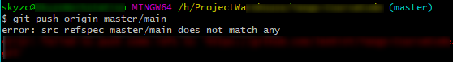

### Git: There is no tracking information for the current branch.

在执行`git pull`的时候，提示当前branch没有跟踪信息：

```shell
git pull
There is no tracking information for the current branch.
Please specify which branch you want to merge with.
```

对于这种情况有两种解决办法，就比如说要操作master吧，一种是直接指定远程master：

```shell
git pull origin master1
```

另外一种方法就是先指定本地master到远程的master，然后再去pull：

```shell
git branch --set-upstream-to=origin/master master
git pull12
```

这样就不会再出现“There is no tracking information for the current branch”这样的提示了。

> Reference:
>
> [Git: There is no tracking information for the current branch.](https://blog.csdn.net/sinat_36246371/article/details/79738782)

### error: src refspec xxx does not match any / error: failed to push some refs to



1、在 github 新建了一个工程

2、本地初始化 ，并关联新建的github地址，在 pull 的时候发现报错

3、发现现在建的 github 工程默认名为了 main

(后面发现由于受到"Black Lives Matter"运动的影响，GitHub 从今年 10 月 1 日起，在该平台上创建的所有新的源代码仓库将默认被命名为 “main”，而不是原先的"master"。)

4、所以 pull 和 push 都会报错
**解决方法：**

统一远程和本地的仓库名称即可

1、把本地的 master 仓库名称修改为远端的 main

```shell
git branch -m oldBranchName newBranchName
```

2、然后，push 就好了

> Reference:
>
> [Git 常见错误 之 error: src refspec xxx does not match any / error: failed to push some refs to 简单解决方法](https://blog.csdn.net/u014361280/article/details/109703556)