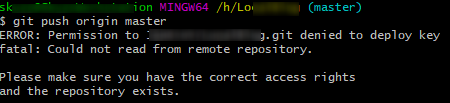
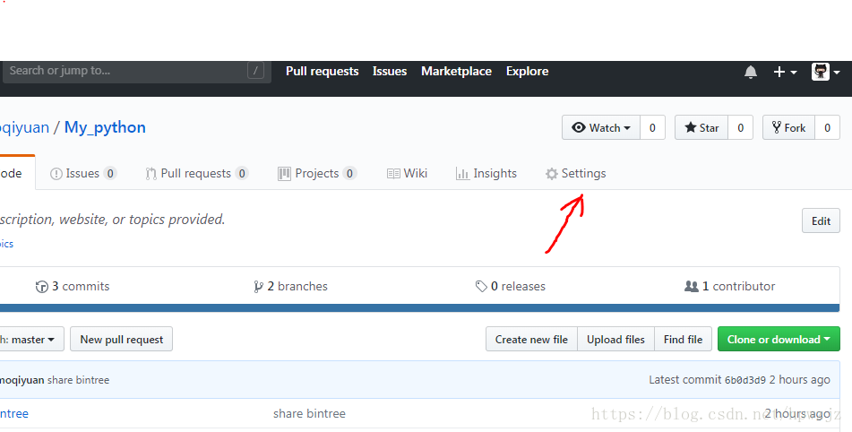
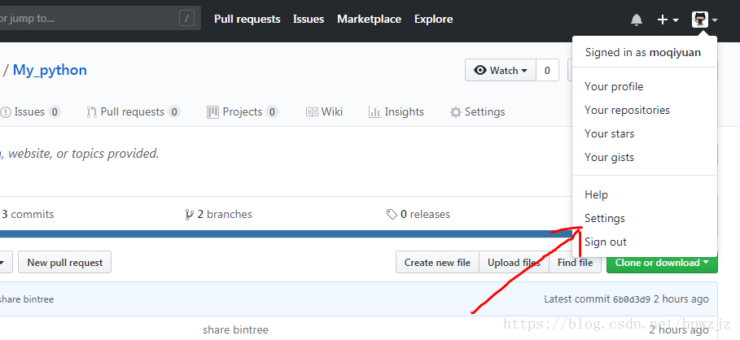
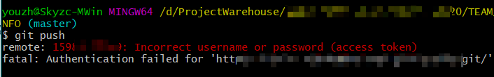

### Git: There is no tracking information for the current branch.

在执行`git pull`的时候，提示当前branch没有跟踪信息：

```shell
git pull
There is no tracking information for the current branch.
Please specify which branch you want to merge with.
```

对于这种情况有两种解决办法，就比如说要操作master吧，一种是直接指定远程master：

```shell
git pull origin master1
```

另外一种方法就是先指定本地master到远程的master，然后再去pull：

```shell
git branch --set-upstream-to=origin/master master
git pull12
```

这样就不会再出现“There is no tracking information for the current branch”这样的提示了。

> Reference:
>
> [Git: There is no tracking information for the current branch.](https://blog.csdn.net/sinat_36246371/article/details/79738782)

### error: src refspec xxx does not match any / error: failed to push some refs to


1、在 github 新建了一个工程

2、本地初始化 ，并关联新建的github地址，在 pull 的时候发现报错

3、发现现在建的 github 工程默认名为了 main

(后面发现由于受到"Black Lives Matter"运动的影响，GitHub 从今年 10 月 1 日起，在该平台上创建的所有新的源代码仓库将默认被命名为 “main”，而不是原先的"master"。)

4、所以 pull 和 push 都会报错
**解决方法：**

统一远程和本地的仓库名称即可

1、把本地的 master 仓库名称修改为远端的 main

```shell
git branch -m oldBranchName newBranchName
```

2、然后，push 就好了

> Reference:
>
> [Git 常见错误 之 error: src refspec xxx does not match any / error: failed to push some refs to 简单解决方法](https://blog.csdn.net/u014361280/article/details/109703556)

### ERROR: Permission to JenKinY/LocalBlog.git denied to deploy key

详细报错：

```shell
ERROR: Permission to xxx.git denied to deploy key
fatal: Could not read from remote repository.

Please make sure you have the correct access rights
and the repository exists.
```



简单的说就是你不能与远程仓库连接了！！ 提示你 git拒绝部署密钥....

乍一看，原来是密钥部署出了问题。博主用的ubunut，检查了多遍本地与gitub上的ssh key.都没有问题。

于是乎，博主去网上search了N种方法，终于找到了答案（不知道有没有人像我这样马虎）

细心地你有没有发现，在gitub上有两个地方可以部署ssh key。



\1. 一个是在你的项目里箭头所指的 settings 里新增ssh key。

 



2.另一个是在个人主页中的settings里面新增ssh key。

 

这两个地方部署ssh key 是不一样的。如果你只是在你的项目里面部署了ssh key，那就意味着你的密钥只能在这个项目里面使用。如果你另外新建一个，或者克隆一个项目，是不能使用这个ssh key的，因为这个ssh key只属于之前的那个项目的，通俗点说：这个ssh key 在我这里，只有我能用，其他人都不能使用。

so，如果想要大家共同使用一个ssh key，你应该把它新增在个人主页下的settings中。

 

如果你的gitub与本地的ssh key都没有问题的话，就有可能是这个问题哦。希望对大家有所帮助。


> Reference:
>
> [分享：git push 时报错 Permission to username/My_python.git denied to deploy key 解决方法](https://blog.csdn.net/hpwzjz/article/details/81459320)


### remote: 15985428639: Incorrect username or password (access token)



原因是账号密码错误

解决方法：打开电脑的控制面板–>用户账户–>管理Windows凭据（win10可以直接搜索 **凭据管理器 ** ）

```shell
//或者 改用SSH方式
git clone git@gitee.com:/gitee账号名/仓库名.git
```

> Reference:
>
> [remote: Incorrect username or password ( access token )](https://blog.csdn.net/qq_25479327/article/details/90270556)