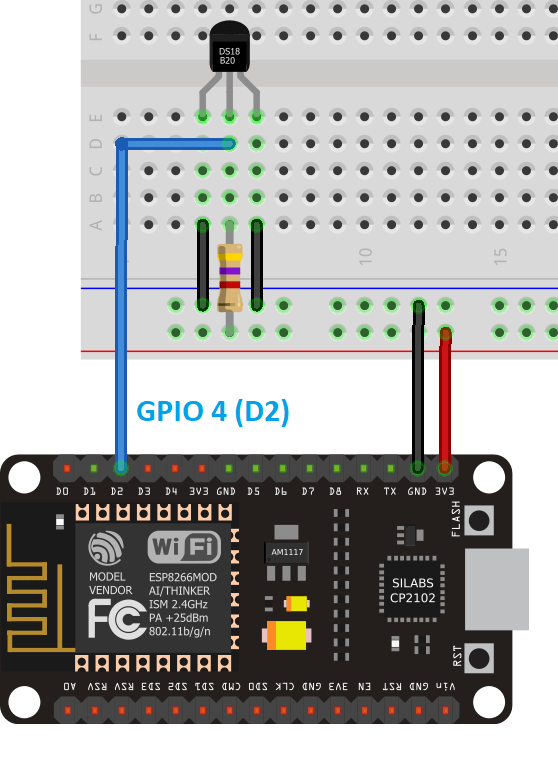
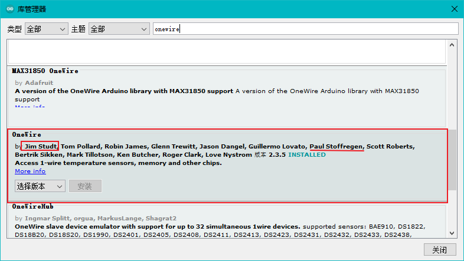
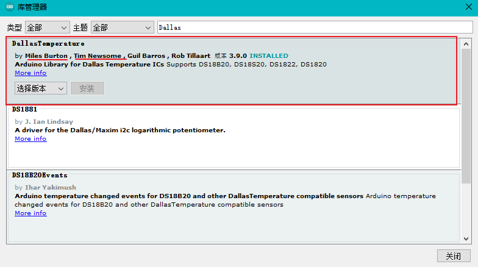
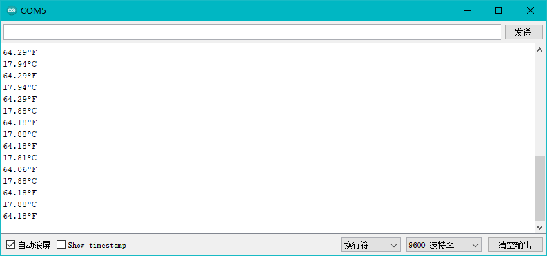

## ESP9266-NodeMCU 获取 DS18B20 温度传感器数据

### 1. 电路连接图



### 2. 安装所需库

1. 打开 Arduino IDE，工具>管理库

2. 安装 `OneWire` 库（确定作者）

   

3. 安装 `DallasTemperature`库

   

### 3. 实现代码

```c++
#include <OneWire.h>
#include <DallasTemperature.h>

// 连接 DS18B20 的 GPIO 引脚编号
const int oneWireBus = 2;     

// 设置一个OneWire 实例以与任何OneWire设备通信
OneWire oneWire(oneWireBus);

// 将oneWire传递给Dallas
DallasTemperature sensors(&oneWire);

void setup() {
  pinMode(D3, OUTPUT);     // 初始化D3引脚，控制 LED小灯闪烁
  // 启动串行监视器
  Serial.begin(9600);
  // 启动DS18B20传感器
  sensors.begin();
}

void loop() {
  // 控制 LED 闪烁
  digitalWrite(D3, LOW);
  delay(1000);                      
  digitalWrite(D3, HIGH);  

  // 获取并输出温度到串口
  sensors.requestTemperatures(); 
  float temperatureC = sensors.getTempCByIndex(0);
  float temperatureF = sensors.getTempFByIndex(0);
  Serial.print(temperatureC);
  Serial.println("ºC");
  Serial.print(temperatureF);
  Serial.println("ºF");
  delay(5000);
}
```

### 4. 实现效果




> 参考:[ESP8266 DS18B20 Temperature Sensor with Arduino IDE (Single, Multiple, Web Server)](https://randomnerdtutorials.com/esp8266-ds18b20-temperature-sensor-web-server-with-arduino-ide/)