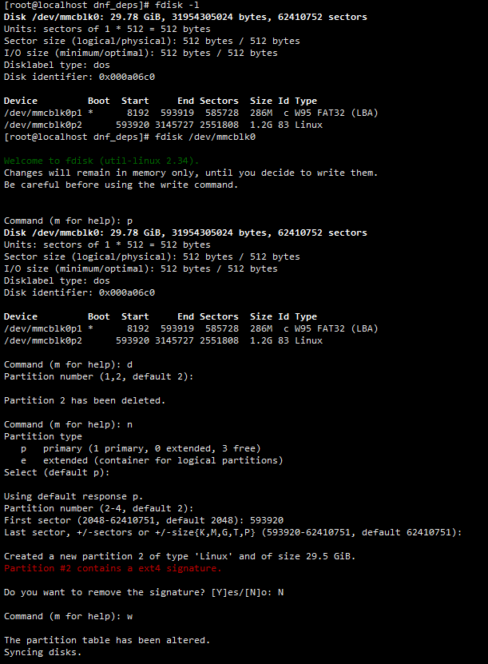
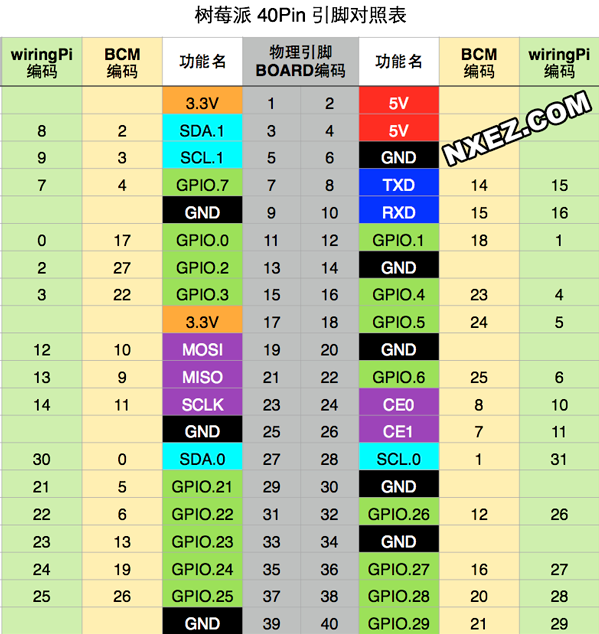
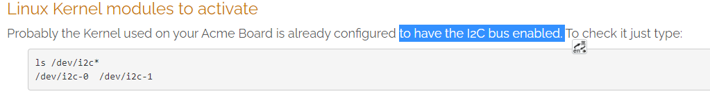

## 一、 镜像烧写

使用 Win32DiskImager 将 HopeEdge-1.0-Raspi3B+.img 写入内存卡，插入树莓派并启动。

初始账号：root

初始密码：hopeedge

## 二、基础设置

### 1. 连接 wifi

```bash
# 查看附近wifi
nmcli dev wifi
# 连接 wifi nmcli dev wifi connect 801-1 password 18305917080
nmcli dev wifi connect "SSID" password "PWD"
# 查看IP地址
ip a
```

连接 wifi 报错(SSID&PWD都没错)，但是可以连接上别的 wifi：

```shell
Error: Connection activation failed: (7) Secrets were required, but not provided.
```

非常疑惑，最后在这篇文章[[CentOS7.5最小化安装之后的配置]](https://blog.csdn.net/chenkaifang/article/details/82531696)里面了解了大概的原因，因为我之前已经连接过该设备，重新刷写系统后可能会出现该问题。

解决办法：

- 重启设备

连接成功后，每次开机默认都会去连接wifi，此时去切换别的wifi会失败，可提前断开连接

```shell
nmcli dev dis wlan0
# 或者
nmcli con del WIFI名称
```


断开连接后，再连接别的wifi就正常了。

彻底删除wifi连接的方法

```shell
# 获取到当前设备所有连接过多的历史连接及对于UUID号码
nmcli c
# 根据 UUID 删除连接，del 后边是UUID号码
nmcli c del 72ffd5f4-71f8-0001-b434-6122908cfd4e
```

### 2. 临时修改时间

```shell
# 查看时间 刚进入系统，时间一般不对会引起很多错误
date
# 修改时间
date -s "20210127 19:28:30"
```

### 3. 根目录分区扩展

具体方法和 openEuler/respberrypi 一样。只是hopeedge 需要扩容的是 /dev/mmcblk0p2。

默认根目录分区空间比较小，在使用之前，需要对分区进行扩容。

#### 查看磁盘分区信息

执行 `fdisk -l` 命令查看磁盘分区信息。命令和回显如下：

```shell
[root@localhost dnf_deps]# fdisk -l
Disk /dev/mmcblk0: 29.78 GiB, 31954305024 bytes, 62410752 sectors
Units: sectors of 1 * 512 = 512 bytes
Sector size (logical/physical): 512 bytes / 512 bytes
I/O size (minimum/optimal): 512 bytes / 512 bytes
Disklabel type: dos
Disk identifier: 0x000a06c0

Device         Boot  Start     End Sectors  Size Id Type
/dev/mmcblk0p1 *      8192  593919  585728  286M  c W95 FAT32 (LBA)
/dev/mmcblk0p2      593920 3145727 2551808  1.2G 83 Linux

```

SD 卡对应盘符为 /dev/mmcblk0，包括 2 个分区，分别为

- /dev/mmcblk0p1：引导分区
- /dev/mmcblk0p2：根目录分区

这里我们需要将根目录分区 `/dev/mmcblk0p2` 进行扩容。

#### 分区扩容

执行 `fdisk /dev/mmcblk0` 命令进入到交互式命令行界面，按照以下步骤扩展分区，如下图所示。

1. 输入 `p`，查看分区信息。

   记录分区 `/dev/mmcblk0p2` 的起始扇区号，即 `/dev/mmcblk0p2` 分区信息中 `Start` 列的值，示例中为 `593920`。

2. 输入 `d`，删除分区。

3. 输入 `2` 或直接按 `Enter`，删除序号为 `2` 的分区，即 `/dev/mmcblk0p2` 分区。

4. 输入 `n`，创建新的分区。

5. 输入 `p` 或直接按 `Enter`，创建 `Primary` 类型的分区。

6. 输入 `2` 或直接按 `Enter`，创建序号为 `2` 的分区，即 `/dev/mmcblk0p2` 分区。

7. 输入新分区的起始扇区号，即第 `1` 步中记录的起始扇区号，示例中为 `593920`。

   > **须知：**   
   >请勿直接按“Enter”或使用默认参数。

8. 按 `Enter`，使用默认的最后一个扇区号作为新分区的终止扇区号。

9. 输入 `N`，不修改扇区标记。

10. 输入 `w`，保存分区设置并退出交互式命令行界面。

    

#### 查看扩容后磁盘分区信息

执行 `fdisk -l` 命令查看磁盘分区信息，以确保磁盘分区正确。命令和回显如下：
    

```
# fdisk -l
Disk /dev/mmcblk0: 14.86 GiB, 15931539456 bytes, 31116288 sectors
Units: sectors of 1 * 512 = 512 bytes
Sector size (logical/physical): 512 bytes / 512 bytes
I/O size (minimum/optimal): 512 bytes / 512 bytes
Disklabel type: dos
Disk identifier: 0xf2dc3842

Device         Boot   Start      End  Sectors  Size Id Type
/dev/mmcblk0p1 *       8192   593919   585728  286M  c W95 FAT32 (LBA)
/dev/mmcblk0p2       593920  1593343   999424  488M 82 Linux swap / Solaris
/dev/mmcblk0p3      1593344 31116287 29522944 14.1G 83 Linux
```

#### 增大未加载的文件系统大小

`resize2fs /dev/mmcblk0p2`

#### 查看磁盘空间信息

执行 `df -lh` 命令查看磁盘空间信息，以确保根目录分区已扩展。
    

> **须知：**   
>如果根目录分区未扩展，可执行 `reboot` 命令重启树莓派之后再执行 `resize2fs /dev/mmcblk0p2`。

### 4. 安装配置 dnf 包管理工具

#### 安装dnf

使用FTP将 `dnf_deps ` 上传到树莓派，然后安装里面的所有包：

下载地址[百度云]：https://pan.baidu.com/s/1hrfTcRdk67cXay4C6o-IyA 提取码：aroj 

```shell
# 安装当前目录下所有包
rpm -ivh *
# 检查
dnf --version
```

#### HopeEdge 配置本地 dnf 仓库

配置本地仓库：

```shell
# 挂载镜像到 /mnt
[root@localhost ~]# mount -o loop ./ISO/HopeEdge-1.0-aarch64-dvd.iso /mnt
mount: /mnt: WARNING: source write-protected, mounted read-only.
[root@localhost ~]# ls /mnt/
EFI  Packages  TRANS.TBL  boot.catalog  images  repodata
```

```shell
# 配置 dnf 源 , 格式和 yum 源一样，注意 gpgkey使用本地的
[root@localhost ~]# vi /etc/yum.repos.d/HopeEdge_aarch64.repo 

# 源的id（不能和其他重复）
[base-local]
# 源的名字（不能和其他重复）
name=HopeEdgeOS-local
# 挂载镜像的目录
baseurl=file:///mnt
# 启用源：1-启用 0-不启用
enabled=1
# 安全检测：1-开启 0-不开启
gpgcheck=0
gpgkey=file:///etc/pki/rpm-gpg/RPM-GPG-KEY-HopeEdge
```

```shell
# 更新 dnf 源配置
[root@localhost ~]# dnf clean all
6 files removed
[root@localhost ~]# dnf makecache
HopeEdgeOS-local                                                                                                                                            27 MB/s | 3.2 MB     00:00    
Last metadata expiration check: 0:00:05 ago on Fri Jul 24 13:03:37 2020.
Metadata cache created.
```

参考: [CentOS7.2配置本地yum源](https://www.cnblogs.com/yybrhr/p/9914392.html)

#### OpenEuler 配置 dnf 仓库地址

```shell
# 编辑配置文件
[root@host-12-0-0-154 ~]# vi /etc/dnf/dnf.conf
[main]
gpgcheck=1
installonly_limit=3
clean_requirements_on_remove=True
best=True
skip_if_unavailable=False

[repository]
name=openeuler
baseurl=https://repo.openeuler.org/openEuler-20.03-LTS/OS/aarch64/
gpgkey=https://repo.openeuler.org/openEuler-20.03-LTS/OS/aarch64/RPM-GPG-KEY-openEuler
```

新增`[repository]`部分。注意其中url的 aarch64 是你系统架构版本。

配置项说明可以在 [openEuler 官方文档](https://openeuler.org/zh/docs/20.03_LTS/docs/Administration/%E4%BD%BF%E7%94%A8DNF%E7%AE%A1%E7%90%86%E8%BD%AF%E4%BB%B6%E5%8C%85.html) 可以看到，并且配置repository部分有两种方式，一种是直接配置`/etc/dnf/dnf.conf`文件中的“repository”部分，另外一种是配置`/etc/yum.repos.d`目录下的.repo文件。

**测试：**

```shell
# 显示软件源列表：
[root@localhost dnf_deps]# dnf repolist             
repo id               repo name
repository            openeuler

# 下载一个 wget 
dnf install -y wget
```


## 三. GPIO

###  1. 简介

树莓派的一个强大特性是沿着板的上边缘有一排 GPIO（通用输入/输出）管脚。在所有当前的树莓派板上都可以找到一个 40 针 GPIO 引脚（在树莓派 Zero 和 Pi Zero W 上未填充）。在树莓派 1B+（2014年）之前，电路板包含较短的 26 针引脚。以树莓派 4B 为例，其 40 针脚见下图：




GPIO 是个比较重要的概念。用户可以通过 GPIO 口和硬件进行数据交互（如 UART），控制硬件工作（如 LED、蜂鸣器等），读取硬件的工作状态信号（如中断信号）等。GPIO 口的使用非常广泛。举例来说，40 个针脚中，有固定输出的 5V（2、4号PIN）、3.3V（1、17号PIN）和地线（Ground，6、9、14、20、25、30、34、39）。如果一个电路两端接在 5V 和地线之间，该电路就会获得 5V 的电压输入，相当于给树莓派通电，注意，此时就不可以再通过树莓派提供的电源同时通电。有一些针脚除了 GPIO 功能外，还提供了高级端口功能。例如，GPIO14 和 GPIO15 就可以充当 UART 端口。下面，我们以使用 UART（GPIO14 和 GPIO15）进行串口通信为例介绍如何使用树莓派 GPIO。

###  2. WiringPi

WiringPi 是应用于树莓派平台的 GPIO 控制库函数，包括一套 GPIO 控制命令，可以控制树莓派GPIO管脚。WiringPi 是可以扩展的，用户可以利用 WiringPi 的内部模块或把自定义的扩展模块集成到 WiringPi 中以扩展更多的 GPIO 接口或支持更多的功能。

当前，[官方](http://wiringpi.com/download-and-install/) 提供的链接无法下载 WiringPi，这里使用 [WiringPi 下载链接](https://github.com/WiringPi/WiringPi)。

#### HopeEdge 安装 WiringPi

```shell
# 首先安装 git
[root@localhost ~]# dnf install -y git
# clone WiringPi
git clone https://github.com/WiringPi/WiringPi.git
# 安装 sudo make gcc
dnf install -y sudo make gcc
# 编译安装 WiringPi
cd WiringPi & sudo ./build
# 查看 gpio 版本
gpio -v
# 查看所有接口
gpio readall
```

注意，使用命令 `gpio readall`，可能会报错：

```shell
wiringPiSetup: mmap (GPIO) failed: Operation not permitted
```

解决方法，编辑 `/boot/cmdline.txt` 添加内容 `iomem=relaxed`，执行 `reboot` 命令重启树莓派。

当前，`/boot/cmdline.txt` 最终内容为：

```shell
console=serial0,115200 console=tty1 root=/dev/mmcblk0p3 rootfstype=ext4 elevator=deadline iomem=relaxed rootwait
```

## 四、I2C

```shell
# 安装 i2c-tools
dnf install -y i2c-tools
```

```shell
# 检测挂载在i2c总线上器件
[root@localhost /]# i2cdetect -y 0
Error: Could not open file `/dev/i2c-0' or `/dev/i2c/0': No such file or directory
```

这里报错，找了很多资料也没有解决。最后在这里看到：

[How to use the I2C ports](https://www.acmesystems.it/i2c)



我们这里报错应该是因为系统配置没有启用 I2C总线。

在原生 Raspberry Pi OS 中，启用 I2C 我们可以利用 raspi-config 或者 配置 `/boot/config.txt`来启用 I2C 总线。因此便再次查找 I2C 在 Linux 系统中的使用方法，终于功夫不负有心人，终于给找到了一个方案，在这过程中也学会了很多 Linux 相关的知识：

[Linux：如何在启动时自动加载内核模块:/etc/modules-load.d](https://www.cyberciti.biz/faq/linux-how-to-load-a-kernel-module-automatically-at-boot-time/)

[内核命令行 /boot/cmdline.txt -The Kernel Command Line](https://www.raspberrypi.org/documentation/configuration/cmdline-txt.md)

[[树莓派学习之I2C通信]](https://www.cnblogs.com/bcy520/p/6816310.html)

解决方案参考：[How to enable I2C](https://www.runeaudio.com/forum/how-to-enable-i2c-t1287.html)

```shell
# 1. 新增 /boot/config.txt
vi /boot/config.txt
# 写入下面内容
device_tree_param=i2c_arm=on
```

```shell
# 2. 修改 /boot/cmdline.txt
vi /boot/cmdline.txt
# 添加下面内容
bcm2708.vc_i2c_override=1
```

```shell
# 3. 新建  /etc/modules-load.d/raspberrypi.conf 
vi /etc/modules-load.d/raspberrypi.conf
# 写入下面内容
i2c-bcm2708
i2c-dev
```

然后重启树莓派后就可以测试：

```shell
# 检测挂载在i2c总线上器件
[root@localhost ~]# i2cdetect -y 1
     0  1  2  3  4  5  6  7  8  9  a  b  c  d  e  f
00:          -- -- -- -- -- -- -- -- -- -- -- -- -- 
10: -- -- -- -- -- -- -- -- -- -- -- -- -- -- -- -- 
20: -- -- -- -- -- -- -- -- -- -- -- -- -- -- -- -- 
30: -- -- -- -- -- -- -- -- -- -- -- -- -- -- -- -- 
40: -- -- -- -- -- -- -- -- -- -- -- -- -- -- -- -- 
50: -- -- -- -- -- -- -- -- -- -- -- -- -- -- -- -- 
60: -- -- -- -- -- -- -- -- -- -- -- -- -- -- -- -- 
70: -- -- -- -- -- -- -- --   
```

在测试成功之后，在重启时看到了一个红红的 [Failed]，并且指向了 `/etc/modules-load.d/`，说明上面步骤中的配置是有问题的！！但是 i2c 同样也被启用成功了，这时我突然有了个想法：难道这个 HopeEdgeOS 启用 i2c 的方法是和 Raspberry Pi OS 一样的？配置重点只在那个 /boot/config.txt 文件里面？

为了验证我这个想法，我把我们在 `/boot/cmdline.txt`和 ``/etc/modules-load.d/raspberrypi.conf`下的配置都注释掉然后重启，果然！之前的 [Failed] 不见了，并且 i2c 也显示成功！！最后我把 `/boot/config.txt`的内容修改成了我们在 Raspberry Pi OS 里启用 I2C 的配置，一样也是启用成功。

```shell
# 新建 config.txt
vi /boot/config.txt
# 写入内容
dtparam=i2c1=on
dtparam=i2c_arm=on
```

因此，**在 HopeEdgeOS 里启用 I2C 和 我们在 Raspberry Pi OS 里启用配置是一样的！只是 我们要手动新建 /boot/config.txt 这个文件**

