>  HopeHome项目地址：https://gitee.com/openeuler2020/team-1647788699.git

## 一、拉取项目到本地

1. 在自己电脑上任意文件夹右键：选择 `Git Bash Here`，打开 Git Bash。

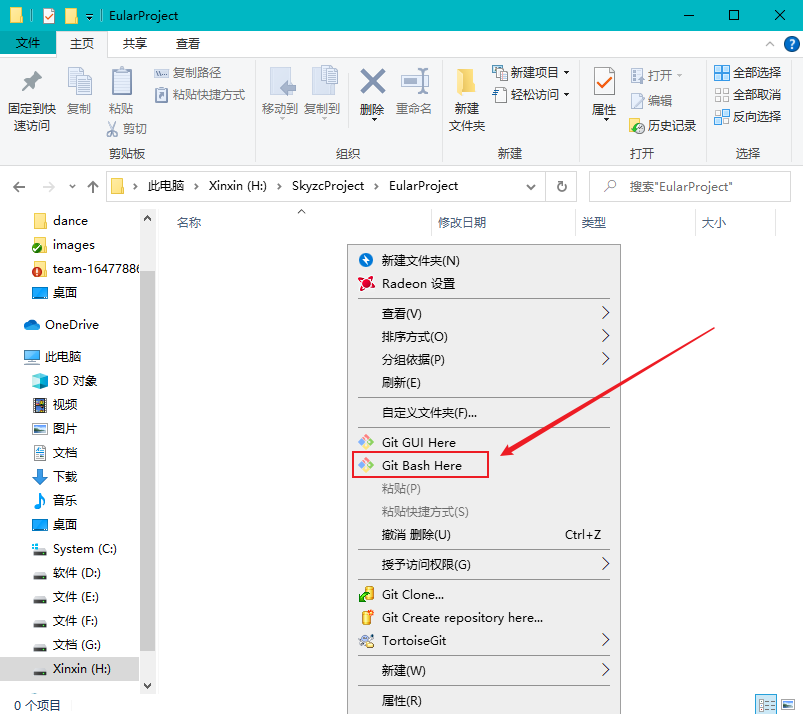

2. 使用`git clone`命令 clone 项目到本地。

```bash
$ git clone 项目地址
```

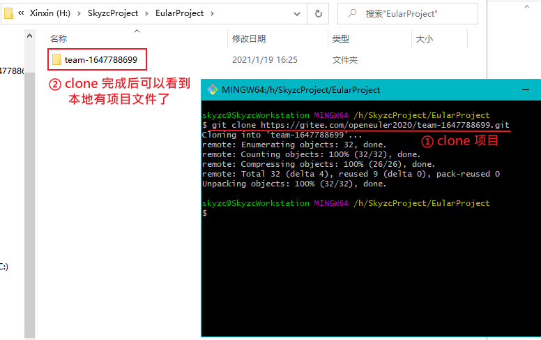

## 二、编写代码

项目clone到本地之后就可以愉快的写代码了。

.....

比如此时完成了一个标注开发者的功能：

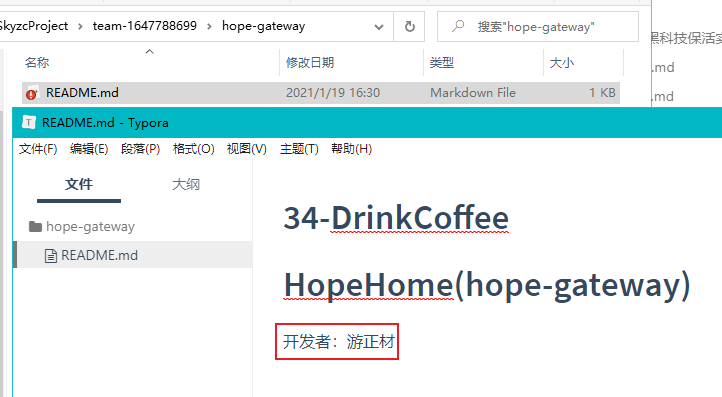

## 三、提交代码到远程仓库次分支

### 01.切换分支

保存代码之后，在项目根目录打开`Git Bash`：

使用命令切换到我负责的分支：

```bash
$ git checkout 你的分支名称
```

切换后，确保后面的蓝色字显示的是你的分支

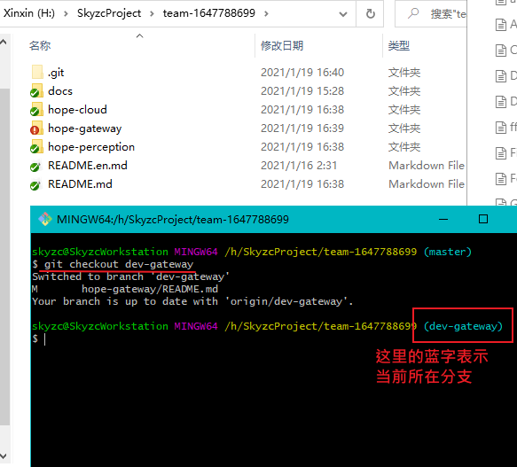

分支切换成功后就可以进行常规的提交了。

### 02. 提交代码到本地仓库

同样确保你在你自己的分支！

两步走：

1. git add 你的目录/*

   此处 "你的目录/*" 表示添加你负责目录下的所有文件

2. git commit -m "规范前缀:提交信息"

   提交信息许哟啊遵循 commit 规范。需要使用前缀（通常使用前面两个即可）：

   ```bash
   docs:修改文档相关 
   	例子：git commit -m "docs:修改README文档"
   feat:表示新功能
   	例子：git commit -m "feat:完成温度采集功能"
   fix:修复Bug
   	例子：git commit -m "fix:修复温度采集数据异常"
   refactor:重构（即不是新增功能，也不是修改bug的代码变动）
   	例子：git commit -m "refactor:重构温度采集模块代码"
   test：增加测试
   	例子：git commit -m "test:新增测试-后端温度解析"
   ```

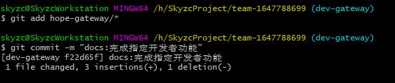

​		此处由于只是修改了文档，使用 docs 即可。如果不清楚写什么群里沟通

​		commit 之后我们代码就进入了本地仓库，但是此时代码还在本地，需要我们提交到Gitee上面去。

### 03. 提交代码到远程仓库

同样确保你在你自己的分支！

两步走：

1. git pull  

   【获取远程分支变化,合并冲突,使本地的次分支最新】

2. git push -u origin 你的分支名

   将目前的本地仓库提交到远程仓库对应的分支下

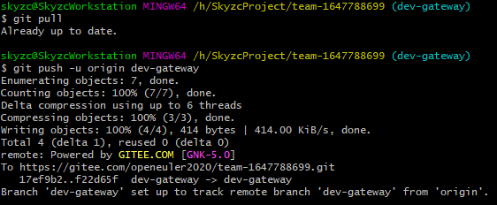

到此，便完成了代码的提交。

### 04. 查看提交

可以到Gitee里面看到我们第提交：

1. 选择自己的分支

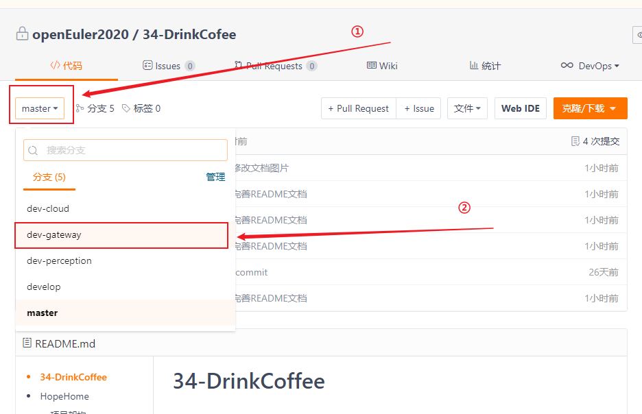

2. 进入后可以看到提交信息

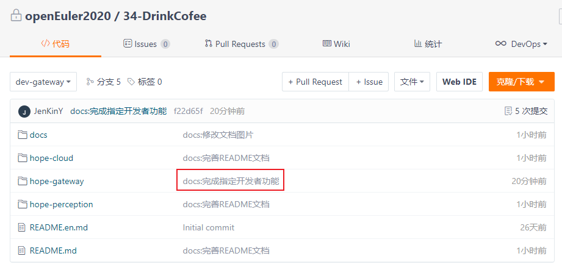

3. 进入检查

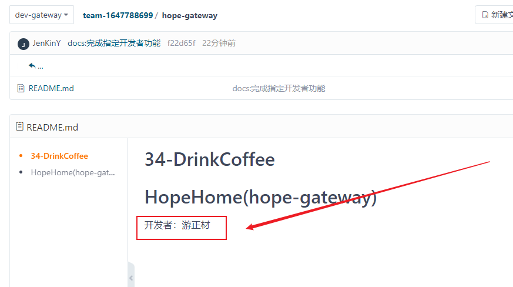

也可以看到我们的修改：

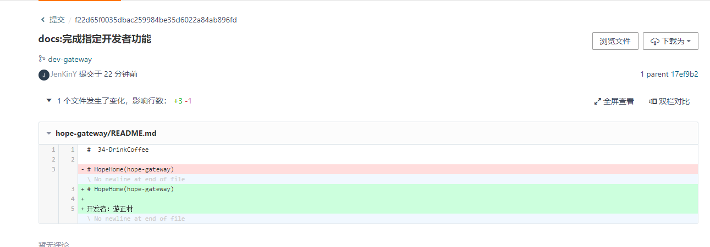

## 四、合并自己的分支到 develop 分支

此步不用每次都做，当在群里通知时或者功能完成后在群里说一声，大家 review 之后可以合并。！！！

在上面的过程中，我们完成了自己分支的开发任务并提交到了远程仓库。但是我们可以看到我们修改的代码只在我们自己的分支中，主分支(develop)是看不见的。

为此我们在 code review 之后，可以将我们的分支合并到主分支(develop)中，这样大家都可以看到我们的代码了。

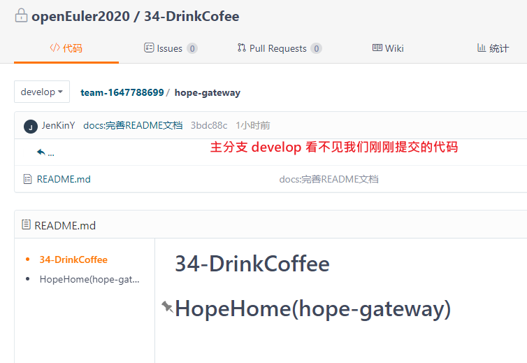

### 01. 切换到主分支（develop）

```bash
$ git checkout develop
```

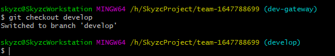

### 02. 将你的次分支合并到本地主分支（develop）

确保你现在在主分支 develop 上！！！

```bash
$ git merge 你的分支名字
```

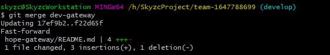

### 03. 将本地主分支提交到远程仓库主分支

上一步只是提交到了本地仓库，现在我们要将更新后的`主分支`本地仓库提交到远程仓库的`主分支。

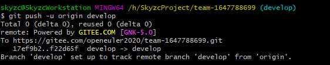

### 04. 检查

提交到远程仓库之后，我们就可以在Gitee看到主分支里也有我们的代码了。

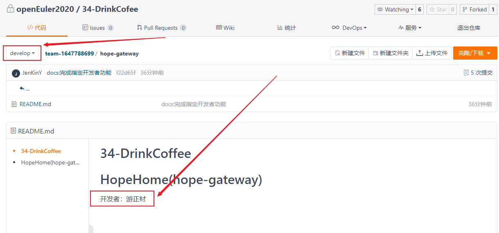

