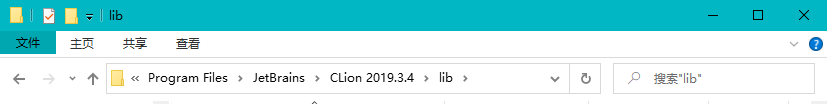

## JetBrains 全家桶激活教程（2019.3.3）

### 一、说明

> **注意：**本教程只做学习研究使用，不得用于商业用途！

1. 软件必须在官网下载：[JetBrains官网](https://www.jetbrains.com/)

2. 注意你的版本不要高于教程版本

3. 本教程适用于 JetBrains 系列产品，并在以下 IDE 版本中测试成功：

   - **IntelliJ IDEA** `2019.3.3及以下`
   - **AppCode** `2019.3.5及以下`
   - **CLion** `2019.3.4及以下`
   - **DataGrip** `2019.3.3及以下`
   - **GoLand** `2019.3.3及以下`
   - **PhpStorm** `2019.3.3及以下`
   - **PyCharm** `2019.3.3及以下`
   - **Rider** `2019.3.4及以下`
   - **RubyMine** `2019.3.3及以下`
   - **WebStorm** `2019.3.3及以下`

4. 本项目只做个人学习研究之用，不得用于商业用途！

   若资金允许，请点击[链接](https://www.jetbrains.com/idea/buy/)购买正版，谢谢合作！

   学生凭学生证可[免费申请](https://sales.jetbrains.com/hc/zh-cn/articles/207154369-学生授权申请方式)正版授权！

   创业公司可[5折购买](https://www.jetbrains.com/shop/eform/startup)正版授权！

### 二、使用教程

#### 1. 下载补丁

1. 百度网盘：https://pan.baidu.com/s/10dyQJob13s9CzU23V-yLAQ 密码：9plx

####  2. 配置补丁

将破解补丁放入 IDE **安装目录**下的 **`/bin`** 文件夹内。

例如我的：

#### 3. 激活IDE

1. 启动软件，然后会弹出 **License Activation** 窗口，此时我们选择**`试用`**（Evaluate for free）:

2.  确认试用：

3. 然后退出：

4. 重新启动IDE，就会弹出窗口，我们点击 `Install jetbrains-agent for CLion` ，然后点击`确认`即可成功进入IDE。

5. 查看激活信息。进入 IDE 后，点击菜单栏 **`"Help>About"`** 即可查看到IDE信息，如果此处显示你的电脑用户名即代表激活成功。若显示的是 "Licensed to Evaluator" 则表示你还在试用状态，激活失败，请检查你的步骤及版本是否正确。

### 三、其他

若在激活过程中遇到问题，请留言或者私信我。