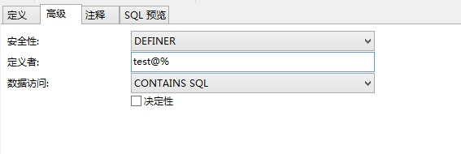

## 1. MySQL 导入 `.sql`文件报错（ERROR 1406）

### 报错信息

MySQL命令行内，使用 `source` 命令：

```bash
mysql> source D:\System\Downloads\chapt5.sql;
ERROR:
Unknown command '\S'.
ERROR:
Unknown command '\D'.
ERROR 1064 (42000): You have an error in your SQL syntax; check the manual that corresponds to your MySQL server version for the right syntax to use near 'hapt5.sql' at line 1
```

### 原因

导入数据时的默认编码（utf8）与导出文件的默认编码（utf8mb4）不一致

### 解决办法

```bash
mysql -uroot -p --default-character-set=utf8mb4 chapt5 < D:\System\Downloads\chapt5.sql
```

或者

在 `source`命令之前先执行：

```bash
mysql> set names utf8; 
```

### 参考连接

[[yeahgis-MySQL数据库导入错误：ERROR 1064 (42000) 和 ERROR at line xx: Unknown command '\Z'.]](https://www.cnblogs.com/yeahgis/p/4358973.html)

## 2. 视图打开错误:The user specified as a definer ('testby'@'%') does not exist

1）在navicat上进行修改

将定义者从test改为在该服务器存在的用户（一般每个服务器都有root@localhost）




### 参考连接

[[1449 - The user specified as a definer ('test'@'%') does not exist]](https://www.cnblogs.com/fnlingnzb-learner/p/7084037.html)