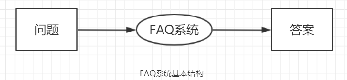

## 📕 项目信息
**为openEuler社区提供一个FAQ的web服务**

**任务编号：** <ins>210010028</ins>
**申请人：**<ins>游正材</ins>

## 👀 项目描述
-   **概要：**使用python进行web编程，实现一个FAQ的web服务，后期可集成到openEuler主页。
-   **背景：**随着openEuler社区逐渐壮大，参与者越来越多，前期参与者遇到的一些问题需要及时的存档并得以传递；社区当前只提供博客这种形式做为经验传递的载体，希望能实现一套FAQ来承载一些问题的处理经验。
-  ** 基础功能：**提供新增FAQ条目、内容提交保存（包括文本和图片）、敏感信息扫描、邮件通知审查人、确认发布等基础功能接口。
-   **附加功能：**访问统计预埋，点击排名，搜索功能。
- **产出标准：**  
使用Python实现一个web服务，提供新增内容编辑，内容扫描，内容展示，和简单查询功能。

-   **技术要求：**  
    1、了解python web服务编程  
    2、了解FAQ系统大致功能和流程
-   **输出：**按照题目描述中基本功能提供web访问API，实现改web应用的后端功能。
-   **导师：**曹志，联系方式：[george.cao@huawei.com](mailto:george.cao@huawei.com)

- **相关项目：** [https://gitee.com/openeuler/infrastructure](https://gitee.com/openeuler/infrastructure)
---
## 📝 项目详细方案
**基本结构：**

**总体结构：**

**功能模块图：**

#### 一、技术选型
**WEB框架使用 Python的 `Flask` 开发框架。**

Flask是一个由Python语言写成的轻量级Web框架，最早由奥地利人Armin Ronacher于2010年发布。Flask最显著的特点是它是一个“微”框架，轻便灵活，但同时又易于扩展。默认情况下，Flask 只相当于一个内核，不包含数据库抽象层(ORM)、用户认证、表单验证、发送邮件等其它Web框架经常包含的功能。Flask依赖用各种灵活的扩展（比如邮件Flask-Mail，用户认证Flask-Login，数据库Flask-SQLAlchemy）来给Web应用添加额外功能。Flask的这种按需扩展的灵活性是很多程序员喜欢它的地方。相对于 Django 来说轻便灵活，同时又易于扩展。

**数据库使用 `PostgreSQL`。**

PostgreSQL数据库是功能强大的开源数据库，它支持丰富的数据类型（如JSON和JSONB类型、数组类型）和自定义类型。

PostgreSQL数据库具有以下优势：

- PostgreSQL数据库是目前功能最强大的开源数据库，它是最接近工业标准SQL92的查询语言，至少实现了SQL:2011标准中要求的179项主要功能中的160项（注：目前没有哪个数据库管理系统能完全实现SQL:2011标准中的所有主要功能）。

- 稳定可靠：PostgreSQL是唯一能做到数据零丢失的开源数据库。目前有报道称国内外有部分银行使用PostgreSQL数据库。

- 开源省钱： PostgreSQL数据库是开源的、免费的，而且使用的是类BSD协议，在使用和二次开发上基本没有限制。

- 支持广泛：PostgreSQL 数据库支持大量的主流开发语言，包括C、C++、Perl、Python、Java、Tcl以及PHP等。

**ORM 使用 `Flask-SQLAlchemy`**

Flask-SQLAlchemy是一个Flask扩展，简化了在Flask程序中使用SQLAlchemy的操作。SQLAlchemy是一个很强大的关系型数据库框架，支持多种数据库后台。SQLAlchemy提供了高层ORM，也提供了使用数据库原生SQL的低层功能。

#### 二、核心技术方案
##### 1. FAQ检索模块实现方案
在一个 FAQ系统中，QA检索功能负责从FAQ数据集中检索出可能与用户搜索相似的若干标准问句，是一个非常重要且使用率最高的一个功能，因此一个准确率高的检索功能，可以大大降低用户在信息检索活动中的时间消耗，增加效率。

FAQ 问答检索主要有以下技术难题：
1.  用户问题较为口语化，包含大量省略、指代等现象；
2.  用户问题复杂多样，基于字面信息很难精准匹配语义相同问题；

要解决这两大问题，就必须要使我们的检索模块尽可能的理解用户所输入的问题并找到对应或者相似的QA对。

下面是设想的几种检索方案：

**方案一：** 对问题分词，使用 SQLAlchemy 直接检索数据库
该方案实现起来相对简单，但是其效率最低，也不利于系统的后期扩展。

**方案二：** 手动实现倒排索引
> **倒排索引**（英语：Inverted index），也常被称为**反向索引**、**置入档案**或**反向档案**，是一种[索引](https://zh.wikipedia.org/wiki/%E7%B4%A2%E5%BC%95 "索引")方法，被用来[存储](https://zh.wikipedia.org/w/index.php?title=%E5%AD%98%E5%82%A8&action=edit&redlink=1 "存储（页面不存在）")在[全文搜索](https://zh.wikipedia.org/w/index.php?title=%E5%85%A8%E6%96%87%E6%90%9C%E7%B4%A2&action=edit&redlink=1 "全文搜索（页面不存在）")下某个单词在一个文档或者一组文档中的[存储位置](https://zh.wikipedia.org/w/index.php?title=%E5%AD%98%E5%82%A8%E4%BD%8D%E7%BD%AE&action=edit&redlink=1 "存储位置（页面不存在）")的[映射](https://zh.wikipedia.org/wiki/%E6%98%A0%E5%B0%84 "映射")。它是[文档检索系统](https://zh.wikipedia.org/w/index.php?title=%E6%96%87%E6%A1%A3%E6%A3%80%E7%B4%A2%E7%B3%BB%E7%BB%9F&action=edit&redlink=1 "文档检索系统（页面不存在）")中最常用的[数据结构](https://zh.wikipedia.org/wiki/%E6%95%B0%E6%8D%AE%E7%BB%93%E6%9E%84 "数据结构")。

在对当数据量不是很大的时候，我们可以自己实现一个倒排索引，并缓存在内存中使用。然后可以将问句中的词语做为倒排的 key。

**方案三：** 使用 Elasticsearch
当数据量比较大，或需要支持并发查询的时候，可以采用ES(Elasticsearch)把数据存储起来，Flask 也有对应的扩展模块 Flask-Elasticsearch 。

QA 检索模块总体流程图：

##### 2. 数据埋点与行为分析方案
埋点，是网站分析的一种常用的数据采集方法。我们主要用来采集用户行为数据（例如页面访问路径，点击了什么元素）进行数据分析，从而让我们更加了解用户的情况，能够对系统进行针对性的优化。现在市面上有很多第三方埋点服务商，百度统计，Google Analytics 等。

用户行为数据分析是一个大系统。主要由`用户数据采集`，`用户行为建模分析`，`可视化报表展示`几个模块构成。现有的埋点采集方案可以大致被分为三种，手动埋点，可视化埋点，无埋点。
1.  手动埋点  
    手动代码埋点比较常见，需要调用埋点的业务方在需要采集数据的地方调用埋点的方法。优点是流量可控，业务方可以根据需要在任意地点任意场景进行数据采集，采集信息也完全由业务方来控制。这样的有点也带来了一些弊端，需要业务方来写死方法，如果采集方案变了，业务方也需要重新修改代码，重新发布。
2.  可视化埋点  
    可是化埋点是近今年的埋点趋势，很多大厂自己的数据埋点部门也都开始做这块。优点是业务方工作量少，缺点则是技术上推广和实现起来有点难（业务方前端代码规范是个大前提）。阿里的活动页很多都是运营通过可视化的界面拖拽配置实现，这些活动控件元素都带有唯一标识。通过埋点配置后台，将元素与要采集事件关联起来，可以自动生成埋点代码嵌入到页面中。
3.  无埋点  
    无埋点则是前端自动采集全部事件，上报埋点数据，由后端来过滤和计算出有用的数据，优点是前端只要加载埋点脚本。缺点是流量和采集的数据过于庞大，服务器性能压力山大，主流的 GrowingIO 就是这种实现方案。

在本系统中，主要涉及到 `PV`、 `单个QA的搜索量`、`单个QA的点击量`这三个关键数据。其中 QA 的搜索和点击量尤为重要，它是我们对系统针对性优化的关键数据。
根据本系统的数据采集场景，综合三大埋点方案，最后选择**手动埋点**方案来实现数据预埋功能。
流程图如下：

---
## 🗓 项目开发时间计划：
第一阶段开发计划：

| 序号 | 日期        | 事项                   | 备注 |
| ---- | ----------- | ---------------------- | ---- |
| 1    | 07.01-07.15 | FAQ系统基本WEB框架搭建 |   包括QA数据集的收集   |
| 2    | 07.16-07.23 | 实现QA库管理模块       |      |
| 3    | 07.23-07.30 | 前端展示页面的实现     |      |
| 4    | 07.31-08.05 | 搜索功能的实现与优化   |      |
| 5    | 08.05-08.15 | 后端数据可视化         |      |
| 6    | 08.16-08.25 | 数据埋点               |      |
| 7    | 07.02-08.25 | 单元测试               |      |
| 8    | 08.05-08.15 | 阶段性集成测试         |      |

甘特图：
