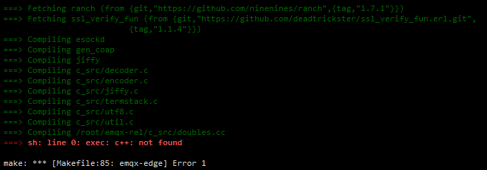

打算在OpenEuler 上编译安装 EMQ，出现下面错误：
```shell
[root@openEuler ~]# cd emqx-rel && make emqx-edge
/usr/bin/env: 'escript': No such file or directory
/usr/bin/env: 'escript': No such file or directory
/root/emqx-rel/ensure-rebar3.sh 3.13.2-emqx-4
/usr/bin/env: 'escript': No such file or directory
  % Total    % Received % Xferd  Average Speed   Time    Time     Time  Current
                                 Dload  Upload   Total   Spent    Left  Speed
100   632  100   632    0     0    882      0 --:--:-- --:--:-- --:--:--   883
100  847k  100  847k    0     0  74799      0  0:00:11  0:00:11 --:--:-- 38113
ln -snf _build/emqx-edge/lib ./_checkouts
/usr/bin/env: 'escript': No such file or directory
EMQX_DESC="EMQ X Edge" /root/emqx-rel/rebar3 as emqx-edge release
/usr/bin/env: ‘escript’: No such file or directory
make: *** [Makefile:85: emqx-edge] Error 127
```

分析后发现应该是 erlang 环境没有配置

安装 erlang:

```shell
[root@openEuler ~]# dnf install -y erlang
```

再次编译出现以下两个错误：




可以看到 rebar3 没有找到，并且 C++ 编译环境也没有。

> 解决办法

安装 rebar3:

```shell
[root@openEuler ~]# dnf install -y rebar3
```

安装 gcc-c++:

```shell
[root@openEuler ~]# dnf install -y gcc-c++
```


