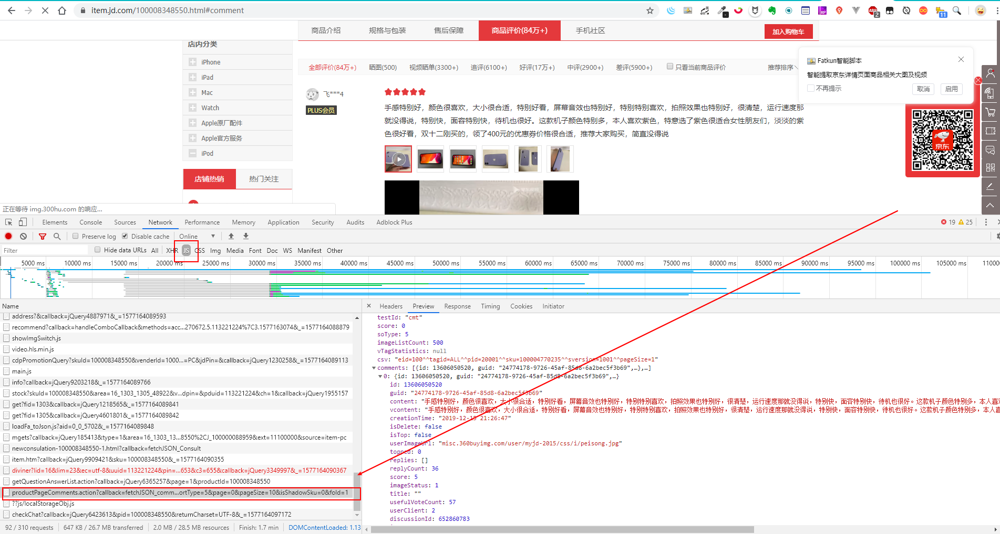
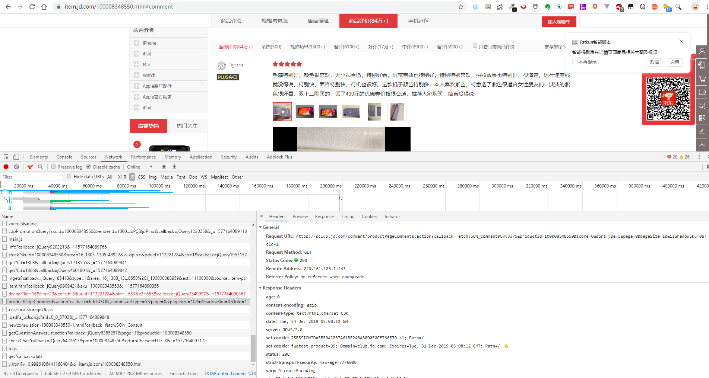
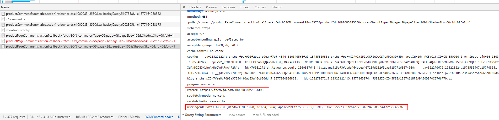
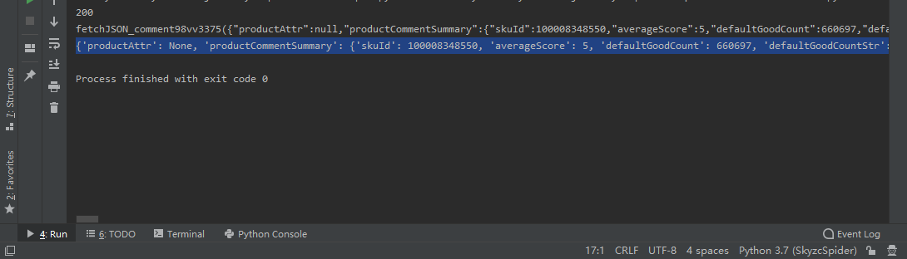
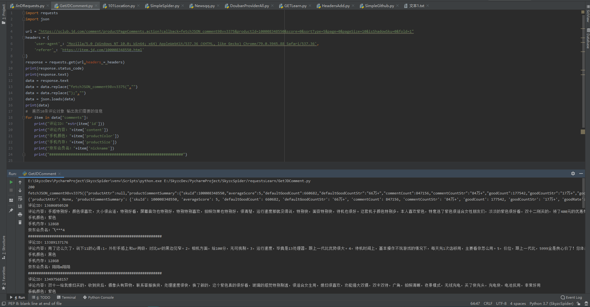

## 一、分析页面

分析页面数据，找到对应的数据请求，请查看请求的详细信息。





于是可以确定获取评论的请求地址：

```python
https://sclub.jd.com/comment/productPageComments.action?callback=fetchJSON_comment98vv3375&productId=100008348550&score=0&sortType=5&page=0&pageSize=10&isShadowSku=0&fold=1
```

翻页后再次对比查看：

```python
第二页：https://sclub.jd.com/comment/productPageComments.action?callback=fetchJSON_comment98vv3375&productId=100008348550&score=0&sortType=5&page=1&pageSize=10&isShadowSku=0&rid=0&fold=1
第三页：https://sclub.jd.com/comment/productPageComments.action?callback=fetchJSON_comment98vv3375&productId=100008348550&score=0&sortType=5&page=2&pageSize=10&isShadowSku=0&rid=0&fold=1
```

可见翻页的参数为：其他参数可以暂时不用处理

```python
page=页数(从0开始)
pageSize=10(每页评论数量)
```

接下来就编写代码来验证我们的分析。

## 二、代码编写

### 1. 数据爬取

```python
import requests # 使用requests库来请求数据

url = "https://sclub.jd.com/comment/productPageComments.action?callback=fetchJSON_comment98vv3375&productId=100008348550&score=0&sortType=5&page=0&pageSize=10&isShadowSku=0&fold=1"
headers = {
    'user-agent' : 'Mozilla/5.0 (Windows NT 10.0; Win64; x64) AppleWebKit/537.36 (KHTML, like Gecko) Chrome/79.0.3945.88 Safari/537.36'
}
response = requests.get(url,headers = headers)
print(response.status_code)
print(response.text)
```

运行结果：

```bash
E:/SkyzcDev/***/GetJDComment.py
200

Process finished with exit code 0

```

发现虽然请求成功了返回了 200 ，但是并没有数据返回。

于是尝试在请求头中加入 `referer` 参数，使得返回正确的数据。



```python
...
headers = {
    'user-agent' : 'Mozilla/5.0 (Windows NT 10.0; Win64; x64) AppleWebKit/537.36 (KHTML, like Gecko) Chrome/79.0.3945.88 Safari/537.36',
    'referer' : 'https://item.jd.com/100008348550.html'
}
...
```

运行结果如下，请求成功并返回了正确的 JSON 数据。

```bash
E:/SkyzcDev/***/GetJDComment.py
200
fetchJSON_comment98vv3375({
...
[{"id":13606050520,"guid":"24774178-9726-45af-85d8-6a2bec5f3b69","content":"手感特别好，颜色很喜欢，大小很合适，特别好看，屏幕音效也特别好，特别特别喜欢，拍照效果也特别好，很清楚，运行速度那就没得说，特别快，面容特别快，待机也很好。这款机子颜色特别多，本人喜欢紫色，特意选了紫色很适合女性朋友们，淡淡的紫色很好看，双十二刚买的，领了400元的优惠券价格很合适，推荐大家购买，简直没得说","vcontent":"手感特别好，颜色很喜欢，大小很合适，特别好看，屏幕音效也特别好，特别特别喜欢，拍照效果也特别好，很清楚，运行速度那就没得说，特别快，面容特别快，待机也很好。这款机子颜色特别多，本人喜欢紫色，特意选了紫色很适合女性朋友们，淡淡的紫色很好看，双十二刚买的，领了400元的优惠券价格很合适，推荐大家购买，简直没得说","creationTime":"2019-12-15 21:26:47","isDelete":false,"isTop":false,"userImageUrl":"misc.360buyimg.com/user/myjd-2015/css/i/peisong.jpg","topped":0,"replies":
...

Process finished with exit code 0
```

### 2. JSON数据解析

```python
data = json.loads(response.text)
```

直接进行序列化会报错。


检查数据后发现在数据的开始会有一段

```python
fetchJSON_comment98vv3375(...)
```

分析后发现，此段数据是由于请求中的 `callback=fetchJSON_comment98vv3375`参数产生的。去掉该字符然后再序列化 JSON数据。

```python
data = response.text
data = data.replace("fetchJSON_comment98vv3375(","")
data = data.replace(");","")
data = json.loads(data)
print(data)
```



### 3. 最终程序

```python
import requests
import json

url = "https://sclub.jd.com/comment/productPageComments.action?callback=fetchJSON_comment98vv3375&productId=100008348550&score=0&sortType=5&page=0&pageSize=10&isShadowSku=0&fold=1"
headers = {
    'user-agent' : 'Mozilla/5.0 (Windows NT 10.0; Win64; x64) AppleWebKit/537.36 (KHTML, like Gecko) Chrome/79.0.3945.88 Safari/537.36',
    'referer' : 'https://item.jd.com/100008348550.html'
}
response = requests.get(url,headers = headers)
print(response.status_code)
print(response.text)
data = response.text
data = data.replace("fetchJSON_comment98vv3375(","")
data = data.replace(");","")
data = json.loads(data)
print(data)
#  遍历10条评论对象 输出我们需要的信息
for item in data["comments"]:
    print("评论ID："+str(item['id']))
    print("评论内容："+item['content'])
    print("手机颜色："+item['productColor'])
    print("手机内存："+item['productSize'])
    print("京东会员名："+item['nickname'])
    print("##############################################################")

```




### 4.优化程序

由于我们上面的程序只是爬取了第一页的评论，并且我们成功分析了翻页的请求规律，因此该程序还可优化。包括爬取多页、函数的抽取等等。最后设计为4个模块：

```python
# 爬取数据
def get_data():
    pass

# 格式化数据，返回 JSON
def format_data():
    pass

# 保存数据
def save_data():
    pass

def main():
    pass

if __name__ == '__main__':
    main()

```


