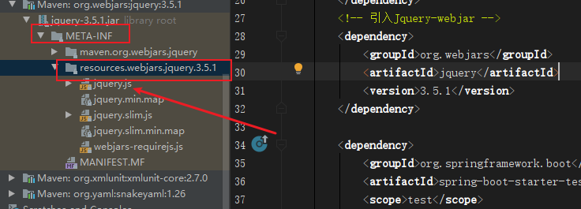

BiliBili雷丰阳Spring Boot教程：

[Spring Boot_权威教程_spring boot_springboot核心篇+springboot整合篇-_雷丰阳_尚硅谷](https://www.bilibili.com/video/BV1Et411Y7tQ?from=search&seid=12327859294412801239)

内容概要（共16章节）：

1. Spring Boot入门
2. Spring Boot配置
3. Spring Boot与日志
4. Spring Boot与Web开发
5. Spring Boot与Docker
6. Spring Boot与数据访问
7. Spring Boot启动配置原理
8. Spring Boot自定义starters
9. Spring Boot与缓存
10. Spring Boot与消息
11. Spring Boot与检索
12. Spring Boot与任务
13. Spring Boot与安全
14. Spring Boot与分布式
15. Spring Boot与开发热部署
16. Spring Boot与监控管理

## 一、Spring Boot 入门

> 简介、HelloWorld、原理分析

### 1.简介

Spring Boot 来`简化Spring应用开发`，约定大于配置，去繁从简。

**背景：**

J2EE笨重的开发、繁多的配置、低下的开发效率、复杂的部署流程、第三方技术集成难度打/

**解决：**

“Spring全家桶”时代。

Spring Boot → J2EE一站式解决方案

Spring Cloud → 分布式整体解决方案 

**优点：**

- 快速创建独立运行的Spring项目以及主流框架集成
- 使用嵌入式的 Servlet 容器，应用无需打成 WAR 包
- starters 自动依赖与版本控制
- 大量的自动配置，简化开发，也可以修改默认值
- 无需配置XML，无代码生成，开箱即用
- 准生产环境的运行时应用监控
- 与云计算的天然集成

### 2. 微服务

在2014年由 [Martin Fowler](https://martinfowler.com) 提出。

[微服务](https://martinfowler.com/microservices)：架构风格

一个应用应该是一组小型服务，可以通过HTTP的方式进行互通。

每一个功能元素最终都是一个可独立替换独立升级的软件单元。

[详细参照微服务文档](https://martinfowler.com/articles/microservices.html)


传统的单体应用（All in one）。

### 3. Spring Boot HelloWorld

一个功能：

浏览器发送hello请求，服务器接收请求并处理，响应Hello World字符串。

#### 3.1 创建一个 maven 工程；（jar）

#### 3.2 导入Spring boot 相关的依赖

```xml
    <parent>
        <artifactId>spring-boot-starter-parent</artifactId>
        <groupId>org.springframework.boot</groupId>
        <version>1.5.9.RELEASE</version>
    </parent>
    <dependencies>
        <dependency>
            <groupId>org.springframework.boot</groupId>
            <artifactId>spring-boot-starter-web</artifactId>
        </dependency>
    </dependencies>
```

#### 3.3 编写一个主程序，用于启动Spring Boot应用

```java
/**
*  @SpringBootApplication 来标注一个主程序类，说明这是一个 Spring Boot 应用
* */
@SpringBootApplication
public class HelloWorldMainApplication {
    public static void main(String[] args) {
        // 启动 SpringApplication
        SpringApplication.run(HelloWorldMainApplication.class,args);
    }
}
```

#### 3.4 编写业务代码，相关的 Controller、Service等

```java
@Controller
public class HelloController {
    @ResponseBody
    @RequestMapping("/hello")
    public String hello(){
        return "Hello World";
    }
}
```

#### 3.5 运行主程序测试

#### 3.6 简化部署

首先添加依赖

```xml
    <!--  这个插件 可以将应用打包成一个可执行的 Jar 包  -->
    <build>
        <plugins>
            <plugin>
                <groupId>org.springframework.boot</groupId>
                <artifactId>spring-boot-maven-plugin</artifactId>
            </plugin>
        </plugins>
    </build>
```

即可将该应用打成 Jar 包，直接使用

```bash
java -jar Jar报名
```

即可运行。

### 4. HelloWorld 探究

####  4.1 POM文件

##### 4.1.1 父项目

```xml
    <parent>
        <artifactId>spring-boot-starter-parent</artifactId>
        <groupId>org.springframework.boot</groupId>
        <version>1.5.9.RELEASE</version>
    </parent>
他的父项目是
	<parent>
		<groupId>org.springframework.boot</groupId>
		<artifactId>spring-boot-dependencies</artifactId>
		<version>1.5.9.RELEASE</version>
		<relativePath>../../spring-boot-dependencies</relativePath>
	</parent>
他来真正管理 Spring Boot 应用里面的所有依赖版本
```

Spring Boot 的版本仲裁中心。

以后我们导入依赖默认是不需要写版本号的。

（没有在 dependencies 里面管理的依赖自然需要声明版本号）

##### 4.1.2启动器

```xml
 		<dependency>
            <groupId>org.springframework.boot</groupId>
            <artifactId>spring-boot-starter-web</artifactId>
        </dependency>
```

**spring-boot-starter**-web:

spring-boot-starter: spring-boot 场景启动器。帮我们导入了web模块正常运行所依赖的组件。

Spring Boot 将所有的功能都抽取出来，做成一个个starters（启动器），只需要在项目里映入这些starter相关场景的所有依赖都会导入进来，并且版本会由`spring-boot-dependencies`来控制。

要用什么功能，就导入什么场景的启动器。

#### 4.2 主程序类，主入口类

```java
/**
*  @SpringBootApplication 来标注一个主程序类，说明这是一个 Spring Boot 应用
* */
@SpringBootApplication
public class HelloWorldMainApplication {
    public static void main(String[] args) {
        // 启动 SpringApplication
        SpringApplication.run(HelloWorldMainApplication.class,args);
    }
}
```

`@SpringBootApplication`: Spring Boot 应用标注在某个类上说明这个类是一个SpringBoot的主配置类，Spring Boot就应该运行这个类的main()方法来启动Spring Boot 项目。

实际上 @SpringBootApplication 是一个组合注解，由以下注解组成：

```java
@Target({ElementType.TYPE})
@Retention(RetentionPolicy.RUNTIME)
@Documented
@Inherited
@SpringBootConfiguration
@EnableAutoConfiguration
@ComponentScan(
    excludeFilters = {@Filter(
    type = FilterType.CUSTOM,
    classes = {TypeExcludeFilter.class}
), @Filter(
    type = FilterType.CUSTOM,
    classes = {AutoConfigurationExcludeFilter.class}
)}
)
public @interface SpringBootApplication {
```

其中

 `@SpringBootConfiguration`：Spring Boot 的配置类：标注在某个类上，表示这是一个Spring Boot 配置类。它由以下注解组成

```java
@Target({ElementType.TYPE})
@Retention(RetentionPolicy.RUNTIME)
@Documented
@Configuration
public @interface SpringBootConfiguration {
```

其中

**@Configuration**：（这是一个Spring定义注解）配置类上来标注这个注解。配置类就是配置文件。配置类也是容器中的一个组件：@Component

`EnableAutoConfiguration` ：开启自动配置功能

以前我们需要配置的东西，Spring Boot 帮我们自动配置。

他也是一个组合注解：

```java
...
@AutoConfigurationPackage
@Import({EnableAutoConfigurationImportSelector.class})
public @interface EnableAutoConfiguration {
```

**@AutoConfigurationPackage**：自动配置包。

​          @Import({Registrar.class}) 

​           Spring的底层注解 @Import ，给容器中导入一个组件；导入的组件由

​            EnableAutoConfigurationImportSelector.class

​            `将主配置类（@SpringBootApplication标注的类）所在的包及其所有的子包里面的所有组件导入扫描到Spring 容器中。`

**@Import({EnableAutoConfigurationImportSelector.class})**：

​        给容器中导入组件。

​       EnableAutoConfigurationImportSelector：导入哪些组件的选择器

​       将所有需要导入的组件以全类名的方式返回，这些组件就会被添加到容器中。

​       会给容器中导入非常多的自动配置类（xxxxAutoConfinguration）;就是给容器中导入这个场景所有组件，并配置好这些组件。

​        有了自动配置类，就免去了我们手动编写配置注入功能组件等的工作。

​            SpringFactoriesLoader.loadFactoryNames(EnableAutoConfiguration.class,classLoader);

`Spring Boot 在启动的时候从类路径下的 META-INF/spring.factories中获取EnableAutoConfiguration指定的值，将这些值作为自动配置类导入到容器中，自动配置类就生效，帮我们进行自动配置。`以前我们需要自己配置的东西，自动配置类都帮我们做了

J2EE的整体整合解决方案和自动配置都在 spring-boot-autoconfigure-1.5.9.RELEASE.jar

### 5. 使用Spring Initializer 快速创建 Spring Boot项目

IDE都支持使用Spring的项目创建向导快速创建一个 Spring Boot 项目。


默认生成的Spring Boot项目：

- 主程序已经生成好了，我们只需要编写自己的逻辑
- resources 文件夹目录结构
  - static：保存所有的静态资源
  - templates：保存所有的模板页面；（SpringBoot默认jar包使用嵌入式的Tomcat,默认不支持JSP）;可以使用模板引擎（freemarker、thymeleaf）
  - application.yml：Spring Boot应用的配置文件。可以修改一些默认配置。

## 二、Spring Boot 配置

### 1.配置文件

Spring Boot 使用一个全局的配置文件，配置文件名是固定的：

- application.properties
- application.yml

配置文件的作用：修改Spring Boot自动配置的默认值。

配置文件放在src/main/resources目录或者classpath:/config下。

.yml是YAML(YAML Ain't Markup Language)语言文件，以数据为中心，比JSON\xml等更适合做配置文件

### 2.YAML语法

#### 2.1 基本语法

k:(空格)v：表示一对键值对（空格必须有）。

以空格的缩进来控制层级关系。只要是左对齐的一列数据，都是同一层级的。

属性和值大小写敏感。

#### 2.2 值得写法

**k:v：字面直接写**

​           字符串默认不用加引号。

​			"" 双引号：不会转义字符串里得特殊字符；例如"\n"会换行

​          ''单引号：会转义特殊字符，特殊字符最终只是一个普通字符串数据。例如'\\n'还是显示\\n，而不会换行

**对象、Map(属性和值)（键值对）**

对象还是k:v形式

```yaml
friends:
		lastName: zhangshan
		age: 20
```

行内写法：

```yaml
friends: {lastName: zhangsan,age: 18}
```

**数组（List、Set）**

用- 值 表示数组中的一个元素：

```yaml
pets:
 - cat
 - dog
 - pig
```

行内写法：

```yaml
pets: [cat,dog,pig]
```

### 3. 配置文件值注入

#### 3.1 yaml文件

配置文件：

```yaml
person:
  lastName: zhangsan
  age: 18
  boss: false
  birth: 2018/2/3
  maps: {k1: v1,k2: v2}
  lists:
    - lisi
    - zhaoliu
  dog:
     name: 小狗
     age: 2
```

JavaBean:

```java
/**
 *  将配置文件中配置的每一个属性的值，映射到这个组件中
 *  @ConfigurationProperties 告诉SpringBoot将本类中的所有属性和配置文件中相关配置进行绑定
 *  prefix = "person" 配置文件中哪一个下面的所有属性进行意义映射
 *	默认从全局配置文件中获取值
 *  只有这个组件是容器中的组件，容器才能提供@ConfigurationProperties功能
 * */
@Component
@ConfigurationProperties(prefix = "person")
public class Person {
    private String lastName;
    private Integer age;
    private Boolean boss;
    private Date birth;

    private Map<String,Object> maps;
    private List<Object> lists;
    private Dog dog;
```

我们可以导入配置文件处理器，以后编写配置就有提示了：

```xml
        <!-- 导入配置文件处理器，配置文件进行绑定就会有提示 -->
        <dependency>
            <groupId>org.springframework.boot</groupId>
            <artifactId>spring-boot-configuration-processor</artifactId>
            <optional>true</optional>
        </dependency>
```

测试及结果：


#### 3.2 properties配置文件在IDEA中默认utf-8可能会乱码

#### 解决：

- 在设置中设置 file encoding。
- 删除项目自带的配置文件，自己新建一个。

#### 3.3 @Value 获取值和@ConfigurationProperties获取值比较

|                              | @ConfigurationProperties | @Value     |
| ---------------------------- | ------------------------ | ---------- |
| 功能                         | 批量注入配置文件中的属性 | 一个个指定 |
| 松散绑定（松散语法）         | 支持                     | 不支持     |
| SpEL                         | 不支持                   | 支持       |
| JSR303数据校验（@Validated） | 支持                     | 不支持     |
| 复杂类型封装                 | 支持                     | 不支持     |


配置文件yml还是properties，都能获取到值。

如果说，我们只是在某个业务逻辑中需要获取一下配置文件中的某项值，使用@Value。

如果说，我们专本编写了一个JavaBean来和配置文件进行映射，就使用@ConfigurationProperties。

#### 3.4 配置文件注入值数据校验

```java
@Component
@ConfigurationProperties(prefix = "person")
@Validated
public class Person {
    @Email
    private String lastName;
    .....
```

#### 3.5 @PropertySource&@ImportResource

**@PropertySource**：加载指定的配置文件

```java
@PropertySource(value={"classpath:配置文件名"})
@Component
@ConfigurationProperties(prefix = "person")
public class Person {
    .....
```

**@ImportResource**：导入Spring的配置文件，让配置文件里面的内容生效。

Spring Boot 中没有Spring的配置文件，我们自己编写的配置文件，也不能自动识别。

想让Spring的配置文件生效，并且加载进来。就可以在配置类上标注@ImportResouce。

```java
//导入Spring的配置文件让其生效
@ImportResource(locations = {"classpath:beans.xml"})
```

`TIP:`SpringBoot推荐给容器中添加组件的方式：**全注解方式**

不用编写传统的Spring配置文件

```xml
<?xml version="1.0" encoding="UTF-8"?>
<beans xmlns="http://www.springframework.org/schema/beans"
       xmlns:xsi="http://www.w3.org/2001/XMLSchema-instance"
       xsi:schemaLocation="http://www.springframework.org/schema/beans http://www.springframework.org/schema/beans/spring-beans.xsd">

    <bean id="helloService" class="com.skyzc.springboot.service.HelloService"></bean>
</beans>
```

在Spring中

1. 配置类 ====Spring配置文件
2.  在配置类中使用@Bean注解来给容器添加组件

```java
/**
 *  @Configuration 指明当前类是一个配置类；就是来替代之前的Spring配置文件的
 *  以前 在配置文件中用<bean></bean>标签添加组件
 *  现在 可以用@Bean注解
 * */
@Configuration
public class MyAppConfig {
    // 将方法的返回值添加到容器中，容器中这个组件默认id就是方法名
    @Bean
    public HelloService helloService(){
        System.out.println("配置类 @Bean 给容器中添加组件了。。。");
        return new HelloService();
    }
}
```

### 4. 配置文件占位符

#### 4.1 随机数

```java
${random.value}、${random.int}、${random.long}
${random.int(10)}、${random.int[1024,65536]}
```

#### 4.2 占位符获取之前配置的值，如果没有可以是用:指定默认值

```yaml
person:
  lastName: 张三${random.int}
  age: ${random.int}
  boss: false
  birth: 2018/2/3
  maps: {k1: v1,k2: v2}
  lists:
    - lisi
    - zhaoliu
  dog:
     name: ${person.lastName:hello}_小狗
     age: 2
```

### 5. Profile

#### 5.1 多Profile文件

我们在主配置文件编写的时候，文件名可以是 application-{profile}.properties/yml。

默认使用 application.properties/yml的配置。

#### 5.2 yml支持多文档快方式

在yml中可以使用`---`来指定多个文档块

```yaml
server:
  port: 80
spring:
  profiles:
    active: dev   #在第一块中指定激活
---
server:
  port: 8081
spring:
  profiles: dev  #指定profile名
---
server:
  port: 8082
spring:
  profiles: prod  #指定profile名
```

#### 5.3 激活指定Profile

##### 5.3.1 在配置文件中指定

```yam
spring:
  profiles:
    active: dev #要激活的profile
```

##### 5.3.2 命令行

```bash
....... --spring.profile.active=dev
```

可以直接在测试的时候，在IDEA里配置传入命令行参数：

Edit Configurations>Enviroment>Program arguments填入参数：--spring.profile.active=dev

##### 5.3.3 虚拟机

在IDEA里配置传入命令行参数：

Edit Configurations>Enviroment>VM options填入参数：-Dspring.profile.active=dev

### 6.配置文件加载位置

Spring Boot 启动会自动扫描以下位置的application.properties/yml文件作为Spring Boot的默认配置文件。

优先级`由高到低`，高优先级的配置会覆盖低优先级的配置：

```xml
-file:./config
-file:./
-classpath:/config/
-classpath:/
```

编译成功后不会加载这两个配置路径下的配置文件，因为只会打包类路径下的文件：

```xml
-file:./config
-file:./
```

Spring Boot会从这四个位置全部加载主配置文件，**互补配置**


我们还可以通过在配置文件中添加 `spring.config.location=文件位置` 来改变默认的配置文件位置。

项目打包后，我们可以使用命令行参数的形式(`--spring.config.location=文件位置`)，启动项目的时候来指定配置文件的新位置。指定配置文件和默认加载的这些配置文件共同起作用形成**互补配置**。

### 7. 外部配置加载顺序

**Spring Boot也可以从以下位置加载配置。优先级从高到低；高优先级的配置覆盖低优先级的配置，所有的配置会形成互补配置。**

**1.命令行参数**

所有的配置都可以在命令行上进行指定

java -jar spring-boot-02-config-02-0.0.1-SNAPSHOT.jar --server.port=8087  --server.context-path=/abc

多个配置用空格分开； --配置项=值


2.来自java:comp/env的JNDI属性

3.Java系统属性（System.getProperties()）

4.操作系统环境变量

5.RandomValuePropertySource配置的random.*属性值


**由jar包外向jar包内进行寻找；**

**优先加载带profile**

**6.jar包外部的application-{profile}.properties或application.yml(带spring.profile)配置文件**

**7.jar包内部的application-{profile}.properties或application.yml(带spring.profile)配置文件**


**再来加载不带profile**

**8.jar包外部的application.properties或application.yml(不带spring.profile)配置文件**

**9.jar包内部的application.properties或application.yml(不带spring.profile)配置文件**


10.@Configuration注解类上的@PropertySource

11.通过SpringApplication.setDefaultProperties指定的默认属性

所有支持的配置加载来源；

[参考官方文档](https://docs.spring.io/spring-boot/docs/1.5.9.RELEASE/reference/htmlsingle/#boot-features-external-config)

### 8.自动配置原理

配置文件到底能写什么？怎么写？自动配置原理。

[配置文件能配置的属性参照](https://docs.spring.io/spring-boot/docs/1.5.9.RELEASE/reference/htmlsingle/#common-application-properties)


#### 1.自动配置原理

1. SpringBoot启动时加载主配置类，开启了自动配置功能`@EnableAutoConfiguration`

2. @EnableAutoConfiguration的作用：

   - 利用`AutoConfiguartionImportSelector类`给容器中导入一些组件。

   - 导入哪些组件？

     可以查看它的`selectImports()`方法。

   - 在方法内可以看到这个语句

     List<String> configurations = getCandidateConfigurations(annotationMetadata,      attributes);获取候选的配置
   
     ```java
     SpringFactoriesLoader.loadFactoryNames()
       扫描所有jar包类路径下  META-INF/spring.factories
       把扫描到的这些文件的内容包装成properties对象
       从properties中获取到EnableAutoConfiguration.class类（类名）对应的值，然后把他们添加在容器中
     ```
   

**将 类路径下  META-INF/spring.factories 里面配置的所有EnableAutoConfiguration的值加入到了容器中；**

```properties
# Auto Configure
org.springframework.boot.autoconfigure.EnableAutoConfiguration=\
org.springframework.boot.autoconfigure.admin.SpringApplicationAdminJmxAutoConfiguration,\
org.springframework.boot.autoconfigure.aop.AopAutoConfiguration,\
org.springframework.boot.autoconfigure.amqp.RabbitAutoConfiguration,\
org.springframework.boot.autoconfigure.batch.BatchAutoConfiguration,\
org.springframework.boot.autoconfigure.cache.CacheAutoConfiguration,\
org.springframework.boot.autoconfigure.cassandra.CassandraAutoConfiguration,\
org.springframework.boot.autoconfigure.cloud.CloudAutoConfiguration,\
org.springframework.boot.autoconfigure.context.ConfigurationPropertiesAutoConfiguration,\
org.springframework.boot.autoconfigure.context.MessageSourceAutoConfiguration,\
........
```

每一个这样的  xxxAutoConfiguration类都是容器中的一个组件，都加入到容器中；用他们来做自动配置；

3）、每一个自动配置类进行自动配置功能；

4）、以**HttpEncodingAutoConfiguration（Http编码自动配置）**为例解释自动配置原理；

```java
@Configuration   //表示这是一个配置类，以前编写的配置文件一样，也可以给容器中添加组件
@EnableConfigurationProperties(HttpEncodingProperties.class)  //启动指定类的ConfigurationProperties功能；将配置文件中对应的值和HttpEncodingProperties绑定起来；并把HttpEncodingProperties加入到ioc容器中

@ConditionalOnWebApplication //Spring底层@Conditional注解（Spring注解版），根据不同的条件，如果满足指定的条件，整个配置类里面的配置就会生效；    判断当前应用是否是web应用，如果是，当前配置类生效

@ConditionalOnClass(CharacterEncodingFilter.class)  //判断当前项目有没有这个类CharacterEncodingFilter；SpringMVC中进行乱码解决的过滤器；

@ConditionalOnProperty(prefix = "spring.http.encoding", value = "enabled", matchIfMissing = true)  //判断配置文件中是否存在某个配置  spring.http.encoding.enabled；如果不存在，判断也是成立的
//即使我们配置文件中不配置pring.http.encoding.enabled=true，也是默认生效的；
public class HttpEncodingAutoConfiguration {
  
  	//他已经和SpringBoot的配置文件映射了
  	private final HttpEncodingProperties properties;
  
   //只有一个有参构造器的情况下，参数的值就会从容器中拿
  	public HttpEncodingAutoConfiguration(HttpEncodingProperties properties) {
		this.properties = properties;
	}
  
    @Bean   //给容器中添加一个组件，这个组件的某些值需要从properties中获取
	@ConditionalOnMissingBean(CharacterEncodingFilter.class) //判断容器没有这个组件？
	public CharacterEncodingFilter characterEncodingFilter() {
		CharacterEncodingFilter filter = new OrderedCharacterEncodingFilter();
		filter.setEncoding(this.properties.getCharset().name());
        filter.setForceRequestEncoding(this.properties.shouldForce(Type.REQUEST));
		filter.setForceResponseEncoding(this.properties.shouldForce(Type.RESPONSE));
		return filter;
	}
```

总结：根据当前不同的条件判断，决定这个配置类是否生效？

一但这个配置类生效；这个配置类就会给容器中添加各种组件；这些组件的属性是从对应的properties类中获取的，这些类里面的每一个属性又是和配置文件绑定的；


5）、所有在配置文件中能配置的属性都是在xxxxProperties类中封装者‘；配置文件能配置什么就可以参照某个功能对应的这个属性类

```java
@ConfigurationProperties(prefix = "spring.http.encoding")  //从配置文件中获取指定的值和bean的属性进行绑定
public class HttpEncodingProperties {

   public static final Charset DEFAULT_CHARSET = Charset.forName("UTF-8");
```


**SpringBoot精髓：**

**1）、SpringBoot启动会加载大量的自动配置类**
	
**2）、我们看我们需要的功能有没有SpringBoot默认写好的自动配置类；**
	
**3）、我们再来看这个自动配置类中到底配置了哪些组件；（只要我们要用的组件有，我们就不需要再来配置了）**
	
**4）、给容器中自动配置类添加组件的时候，会从properties类中获取某些属性。我们就可以在配置文件中指定这些属性的值；**


在SpringBoot中会有很多

- xxxxAutoConfigurartion：自动配置类；给容器中添加组件

- xxxxProperties:封装配置文件中相关属性；


#### 2、细节


#### 1、@Conditional派生注解（Spring注解版原生的@Conditional作用）

##### 作用：必须是@Conditional指定的条件成立，才给容器中添加组件，配置配里面的所有内容才生效；

| @Conditional扩展注解            | 作用（判断是否满足当前指定条件）                 |
| ------------------------------- | ------------------------------------------------ |
| @ConditionalOnJava              | 系统的java版本是否符合要求                       |
| @ConditionalOnBean              | 容器中存在指定Bean；                             |
| @ConditionalOnMissingBean       | 容器中不存在指定Bean；                           |
| @ConditionalOnExpression        | 满足SpEL表达式指定                               |
| @ConditionalOnClass             | 系统中有指定的类                                 |
| @ConditionalOnMissingClass      | 系统中没有指定的类                               |
| @ConditionalOnSingleCandidate   | 容器中只有一个指定的Bean，或者这个Bean是首选Bean |
| @ConditionalOnProperty          | 系统中指定的属性是否有指定的值                   |
| @ConditionalOnResource          | 类路径下是否存在指定资源文件                     |
| @ConditionalOnWebApplication    | 当前是web环境                                    |
| @ConditionalOnNotWebApplication | 当前不是web环境                                  |
| @ConditionalOnJndi              | JNDI存在指定项                                   |

**自动配置类必须在一定的条件下才能生效；**

我们怎么知道哪些自动配置类生效？？

**我们可以通过在配置文件中启用  `debug=true`属性；运行项目后，让控制台就会打印自动配置报告**，这样我们就可以很方便的知道哪些自动配置类生效。格式如下：

```java
=========================
AUTO-CONFIGURATION REPORT
=========================


Positive matches:（自动配置类启用的）
-----------------

   DispatcherServletAutoConfiguration matched:
      - @ConditionalOnClass found required class 'org.springframework.web.servlet.DispatcherServlet'; @ConditionalOnMissingClass did not find unwanted class (OnClassCondition)
      - @ConditionalOnWebApplication (required) found StandardServletEnvironment (OnWebApplicationCondition)
        
    
Negative matches:（没有启动，没有匹配成功的自动配置类）
-----------------

   ActiveMQAutoConfiguration:
      Did not match:
         - @ConditionalOnClass did not find required classes 'javax.jms.ConnectionFactory', 'org.apache.activemq.ActiveMQConnectionFactory' (OnClassCondition)

   AopAutoConfiguration:
      Did not match:
         - @ConditionalOnClass did not find required classes 'org.aspectj.lang.annotation.Aspect', 'org.aspectj.lang.reflect.Advice' (OnClassCondition)
        
```


## 三、Spring Boot 与日志

### 1.日志框架

小张；开发一个大型系统；

​		1、System.out.println("")；将关键数据打印在控制台；去掉？写在一个文件？

​		2、框架来记录系统的一些运行时信息；日志框架 ；  zhanglogging.jar；

​		3、高大上的几个功能？异步模式？自动归档？xxxx？  zhanglogging-good.jar？

​		4、将以前框架卸下来？换上新的框架，重新修改之前相关的API；zhanglogging-prefect.jar；

​		5、JDBC---数据库驱动；

​			写了一个统一的接口层；日志门面（日志的一个抽象层）；logging-abstract.jar；

​			给项目中导入具体的日志实现就行了；我们之前的日志框架都是实现的抽象层；


**市面上的日志框架；**

JUL、JCL、Jboss-logging、logback、log4j、log4j2、slf4j....

| 日志门面  （日志的抽象层）                                   | 日志实现                                             |
| ------------------------------------------------------------ | ---------------------------------------------------- |
| ~~JCL（Jakarta  Commons Logging）~~    SLF4j（Simple  Logging Facade for Java）    **~~jboss-logging~~** | Log4j  JUL（java.util.logging）  Log4j2  **Logback** |

左边选一个门面（抽象层）、右边来选一个实现；

日志门面：  SLF4J；

日志实现：Logback；


SpringBoot：底层是Spring框架，Spring框架默认是用JCL；‘

​	**`SpringBoot选用 SLF4j和logback；`**

### 2.SLF4j使用

#### 2.1如何在系统中使用SLF4j

以后开发的时候，日志记录方法的调用，不应该直接调用日志的实现类，而是调用日志抽象层里面的方法。


给系统内导入JLF4J和logback的实现JAR。

```java
import org.slf4j.Logger;
import org.slf4j.LoggerFactory;

public class HelloWorld {
  public static void main(String[] args) {
    Logger logger = LoggerFactory.getLogger(HelloWorld.class);
    logger.info("Hello World");
  }
}
```


每一个日志的实现框架都有自己的配置文件。使用SLF4J后，**配置文件还是做成`日志实现框架`自己本身的配置文件**。

#### 2.2遗留问题

a(slf4j+logback):Spring(commons-logging)，Hibernate(jboss--logging),MyBatis，xxx

在这样的项目中，应该统一日 志记录


**如何让系统中所有日志都统一到slf4j:**

1. 将系统中其他日志框架先排除出去；
2. 用中间包来替换原有的日志框架；
3. 导入SLF4J其他的实现

Spring Boot 就是这样实现的。

### 3、SpringBoot日志关系


SpringBoot日志底层依赖关系：


总结：：

1. SpringBoot底层也是使用slf4j+logback的方式进行日志记录
2. SpringBoot也把其他日志都替换成了slf4j
3. 中间替换包

```java
@SuppressWarnings("rawtypes")
public abstract class LogFactory {

    static String UNSUPPORTED_OPERATION_IN_JCL_OVER_SLF4J = "http://www.slf4j.org/codes.html#unsupported_operation_in_jcl_over_slf4j";

    static LogFactory logFactory = new SLF4JLogFactory();
```


4. 如果我们要引入其他框架？一定要把这个框架默认日志依赖移除掉，不然会造成JAR包冲突。

   Spring框架用的是commons-logging；

   ```xml
   		<dependency>
   			<groupId>org.springframework</groupId>
   			<artifactId>spring-core</artifactId>
   			<exclusions>
   				<exclusion>
   					<groupId>commons-logging</groupId>
   					<artifactId>commons-logging</artifactId>
   				</exclusion>
   			</exclusions>
   		</dependency>
   ```

   

**SpringBoot能自动适配所有的日志，而且底层使用`slf4j+logback`的方式记录日志，引入其他框架的时候，只需要把这个框架依赖的日志框架排除掉即可；**

### 4. 日志使用

#### 4.1 默认配置

SpringBoot默认已经配置了日志。

```java
//记录器
    Logger logger = LoggerFactory.getLogger(getClass());
    @Test
    void contextLoads() {
        // 日志的级别，由低到高
        // 可以调整日志输出的级别，日志就指挥在这个级别以后的高级别生效
        logger.trace("这是trace日志...");
        logger.debug("这是debug日志...");
        // SpringBoot默认给我们使用的是 info 级别。（默认只输出info之后的日志）
        // 没有指定就用SpringBoot默认规定的级别：root级别
        logger.info("这是info日志...");
        logger.warn("这是warn日志...");
        logger.error("这是error日志...");
    }
```

可以在配置文件里调整默认的参数：

```properties
logging.level.top.skyzc=trace

#在某个路径下生成日志文件(可指定完整路径)
#logging.file.name=spring-boot.log

# 在当前磁盘的根路径下创建spring文件夹和里面的log文件夹，使用spring boot默认的文件名
logging.file.path=/spring/log

# file.name 比 file.path 优先级高。但是我们一般使用 file.path

# 在控制台输出的日志的格式
logging.pattern.console=%d{yyyy-MM-dd HH:mm:ss.SSS} [%thread] %-5level %logger{50} - %msg%n
# 在文件输出的日志的格式
logging.pattern.file=%d{yyyy-MM-dd HH:mm:ss.SSS} [%thread] %-5level %logger{50} - %msg%n
```

日志输出格式说明：

```xml
   日志输出格式：
		%d表示日期时间，
		%thread表示线程名，
		%-5level：级别从左显示5个字符宽度
		%logger{50} 表示logger名字最长50个字符，否则按照句点分割。 
		%msg：日志消息，
		%n是换行符
    -->
    %d{yyyy-MM-dd HH:mm:ss.SSS} [%thread] %-5level %logger{50} - %msg%n
```

| logging.file | logging.path | Example  | Description                        |
| ------------ | ------------ | -------- | ---------------------------------- |
| (none)       | (none)       |          | 只在控制台输出                     |
| 指定文件名   | (none)       | my.log   | 输出日志到my.log文件               |
| (none)       | 指定目录     | /var/log | 输出到指定目录的 spring.log 文件中 |

#### 4.2 指定配置

给类路径下放上每个日志框架自己的配置文件即可；SpringBoot就不适用他默认配置的了。

| Logging System          | Customization                                                |
| ----------------------- | ------------------------------------------------------------ |
| Logback                 | `logback-spring.xml`, `logback-spring.groovy`, `logback.xml` or `logback.groovy` |
| Log4j2                  | `log4j2-spring.xml` or `log4j2.xml`                          |
| JDK (Java Util Logging) | `logging.properties`                                         |

logback.xml：直接就被日志框架识别了；

**logback-spring.xml**：日志框架就不直接加载日志的配置项，由SpringBoot解析日志配置，可以使用SpringBoot的高级Profile功能

```xml
<springProfile name="staging">
    <!-- configuration to be enabled when the "staging" profile is active -->
  	可以指定某段配置只在某个环境下生效
</springProfile>

```

如：

```xml
<appender name="stdout" class="ch.qos.logback.core.ConsoleAppender">
        <!--
        日志输出格式：
			%d表示日期时间，
			%thread表示线程名，
			%-5level：级别从左显示5个字符宽度
			%logger{50} 表示logger名字最长50个字符，否则按照句点分割。 
			%msg：日志消息，
			%n是换行符
        -->
        <layout class="ch.qos.logback.classic.PatternLayout">
            <springProfile name="dev">
                <pattern>%d{yyyy-MM-dd HH:mm:ss.SSS} ----> [%thread] ---> %-5level %logger{50} - %msg%n</pattern>
            </springProfile>
            <springProfile name="!dev">
                <pattern>%d{yyyy-MM-dd HH:mm:ss.SSS} ==== [%thread] ==== %-5level %logger{50} - %msg%n</pattern>
            </springProfile>
        </layout>
    </appender>
```


如果使用logback.xml作为日志配置文件，还要使用profile功能，会有以下错误

 `no applicable action for [springProfile]`

### 5.日志框架切换

可以按照 SLF4j 的日志适配图，进行相关切换。

slf4j+log4j的方式；

```xml
<dependency>
  <groupId>org.springframework.boot</groupId>
  <artifactId>spring-boot-starter-web</artifactId>
  <exclusions>
    <exclusion>
      <artifactId>logback-classic</artifactId>
      <groupId>ch.qos.logback</groupId>
    </exclusion>
    <exclusion>
      <artifactId>log4j-over-slf4j</artifactId>
      <groupId>org.slf4j</groupId>
    </exclusion>
  </exclusions>
</dependency>

<dependency>
  <groupId>org.slf4j</groupId>
  <artifactId>slf4j-log4j12</artifactId>
</dependency>

```


切换为log4j2

```xml
   <dependency>
            <groupId>org.springframework.boot</groupId>
            <artifactId>spring-boot-starter-web</artifactId>
            <exclusions>
                <exclusion>
                    <artifactId>spring-boot-starter-logging</artifactId>
                    <groupId>org.springframework.boot</groupId>
                </exclusion>
            </exclusions>
        </dependency>

<dependency>
  <groupId>org.springframework.boot</groupId>
  <artifactId>spring-boot-starter-log4j2</artifactId>
</dependency>
```

-----------------

## 四、WEB开发

### 1.简介

**使用SpringBoot:**

1. 创建SpringBoot应用，选中我们需要的模块
2. SpringBoot已经默认将这些场景配置好了，只需要在配置文件中指定少量配置就可以运行起来
3. 自己编写业务代码

**自动配置原理？**

这个场景SpringBoot帮我们配置了什么?能不能修改？能修改哪些配置？能不能扩展？XXX

```java
xxxxAutoConfiguratiom:帮我们给容器中自动配置组件
xxxxProperties:配置类来封装配置文件的内容
```

### 2. SpringBoot 对静态资源的映射规则

```java
@ConfigurationProperties(prefix = "spring.resources", ignoreUnknownFields = false)
public class ResourceProperties implements ResourceLoaderAware {
  //可以设置和静态资源有关的参数，缓存时间等
```

SpringBoot中，SpringMVC相关的配置都在`WebMvcAutoConfiguration`里面。

WebMvcAutoConfiguration:

```java
        @Override
		public void addResourceHandlers(ResourceHandlerRegistry registry) {
			if (!this.resourceProperties.isAddMappings()) {
				logger.debug("Default resource handling disabled");
				return;
			}
			Integer cachePeriod = this.resourceProperties.getCachePeriod();
			if (!registry.hasMappingForPattern("/webjars/**")) {
				customizeResourceHandlerRegistration(
						registry.addResourceHandler("/webjars/**")
								.addResourceLocations(
										"classpath:/META-INF/resources/webjars/")
						.setCachePeriod(cachePeriod));
			}
			String staticPathPattern = this.mvcProperties.getStaticPathPattern();
          	//静态资源文件夹映射
			if (!registry.hasMappingForPattern(staticPathPattern)) {
				customizeResourceHandlerRegistration(
						registry.addResourceHandler(staticPathPattern)
								.addResourceLocations(
										this.resourceProperties.getStaticLocations())
						.setCachePeriod(cachePeriod));
			}
		}

        //配置欢迎页映射
		@Bean
		public WelcomePageHandlerMapping welcomePageHandlerMapping(
				ResourceProperties resourceProperties) {
			return new WelcomePageHandlerMapping(resourceProperties.getWelcomePage(),
					this.mvcProperties.getStaticPathPattern());
		}

       //配置喜欢的图标
		@Configuration
		@ConditionalOnProperty(value = "spring.mvc.favicon.enabled", matchIfMissing = true)
		public static class FaviconConfiguration {

			private final ResourceProperties resourceProperties;

			public FaviconConfiguration(ResourceProperties resourceProperties) {
				this.resourceProperties = resourceProperties;
			}

			@Bean
			public SimpleUrlHandlerMapping faviconHandlerMapping() {
				SimpleUrlHandlerMapping mapping = new SimpleUrlHandlerMapping();
				mapping.setOrder(Ordered.HIGHEST_PRECEDENCE + 1);
              	//所有  **/favicon.ico 
				mapping.setUrlMap(Collections.singletonMap("**/favicon.ico",
						faviconRequestHandler()));
				return mapping;
			}

			@Bean
			public ResourceHttpRequestHandler faviconRequestHandler() {
				ResourceHttpRequestHandler requestHandler = new ResourceHttpRequestHandler();
				requestHandler
						.setLocations(this.resourceProperties.getFaviconLocations());
				return requestHandler;
			}

		}

```


1）、所有 /webjars/** ，都去 classpath:/META-INF/resources/webjars/ 找资源；（webjars：以jar包的方式引入静态资源；http://www.webjars.org/）



如果要获取该静态资源可以访问：

localhost:8080/webjars/jquery/3.5.1/jquery.js

```
<!-- 引入Jquery-webjar (在访问的时候只需要写webjars下面的资源名称即可)-->
<dependency>
    <groupId>org.webjars</groupId>
    <artifactId>jquery</artifactId>
    <version>3.5.1</version>
</dependency>
```

2）、"/**" 访问当前项目的任何资源。都去（静态资源文件夹）找映射

```
"classpath:/META-INF/resources/", 
"classpath:/resources/",
"classpath:/static/", 
"classpath:/public/" 
"/"：当前项目的根路径
```

localhost:8080/abc ===  去静态资源文件夹里面找abc

3）、欢迎页； 静态资源文件夹下的所有index.html页面；被"/**"映射；

​	localhost:8080/   找index页面

4）、所有的 **/favicon.ico  都是在静态资源文件下找；

### 3.模板引擎

JSP、Velocity、Freemarker、Thymeleaf


SpringBoot推荐的Thymeleaf；

语法更简单，功能更强大；

#### 3.1 引入 thymeleaf

```xml
        <!--    引入 thymeleaf    -->
        <dependency>
            <groupId>org.springframework.boot</groupId>
            <artifactId>spring-boot-starter-thymeleaf</artifactId>
        </dependency>
```

切换 thymeleaf 版本

```xml
<properties>
		<thymeleaf.version>3.0.9.RELEASE</thymeleaf.version>
		<!-- 布局功能的支持程序  thymeleaf3主程序 适配 layout2以上版本 -->
		<!-- thymeleaf2 适配 layout1-->
		<thymeleaf-layout-dialect.version>2.2.2</thymeleaf-layout-dialect.version>
</properties>
```

现在 SpringBoot 2+ 默认使用 thymeleaf 3 .

#### 3.2 Thymeleaf 使用&语法

首先查看thymeleaf的自动配置。

```java
@ConfigurationProperties(
    prefix = "spring.thymeleaf"
)
public class ThymeleafProperties {
    private static final Charset DEFAULT_ENCODING;
    public static final String DEFAULT_PREFIX = "classpath:/templates/";
    public static final String DEFAULT_SUFFIX = ".html";
    private boolean checkTemplate = true;
    private boolean checkTemplateLocation = true;
    private String prefix = "classpath:/templates/";
    private String suffix = ".html";
    private String mode = "HTML";
```

从配置中可知， 只要我们把HTML创建在`"classpath:/templates/"`中，thymeleaf 就能够自动渲染了。

**简单示例：**

001 编写 Controller

```java
@Controller
public class HelloController {
    @RequestMapping("/success")
        public String success(){
            // classpath::/templates/success.html
            return "success";
        }
.....
```

注意此时是使用的 `@Controller`并且方法体上没有“@ResponseBody”，而不是“@RestController”。

002 在 classpath:/templates 下创建 success.html。

003 现在访问 localhost:8080/success 即可访问到页面。

**获取值示例：**

001 在html文件中，导入 thymeleaf 的名称空间

```html
<html lang="en" xmlns:th="http://www.thymeleaf.org">
```

该名称空间的作用是可以在编写html代码是可以获取 thymeleaf的 一些提示。

002 使用 thymeleaf 语法获取值

```html
<!DOCTYPE html>
<html lang="en" xmlns:th="http://www.thymeleaf.org">
<meta charset="UTF-8">
<title>SUCCESS</title>
</head>
<body>
<h1>成功了，wow</h1>
<!-- th:text : 设置文本内容为变量值。若本来就有内容，会直接覆盖原内容-->
<div th:text="${hello}">这是显示欢迎信息</div>
</body>
</html>
```

#### 3.3 语法规则

1. th:text 改变当前元素的文本内容

   th:html原生属性，替换原生属性


2. 表达式

```properties
Simple expressions:（表达式语法）
    Variable Expressions: ${...}：获取变量值；OGNL；
    		1）、获取对象的属性、调用方法
    		2）、使用内置的基本对象：
    			#ctx : the context object.
    			#vars: the context variables.
                #locale : the context locale.
                #request : (only in Web Contexts) the HttpServletRequest object.
                #response : (only in Web Contexts) the HttpServletResponse object.
                #session : (only in Web Contexts) the HttpSession object.
                #servletContext : (only in Web Contexts) the ServletContext object.
                示例：获取 session值
                ${session.foo}
            3）、内置的一些工具对象：
#execInfo : information about the template being processed.
#messages : methods for obtaining externalized messages inside variables expressions, in the same way as they would be obtained using #{…} syntax.
#uris : methods for escaping parts of URLs/URIs
#conversions : methods for executing the configured conversion service (if any).
#dates : methods for java.util.Date objects: formatting, component extraction, etc.
#calendars : analogous to #dates , but for java.util.Calendar objects.
#numbers : methods for formatting numeric objects.
#strings : methods for String objects: contains, startsWith, prepending/appending, etc.
#objects : methods for objects in general.
#bools : methods for boolean evaluation.
#arrays : methods for arrays.
#lists : methods for lists.
#sets : methods for sets.
#maps : methods for maps.
#aggregates : methods for creating aggregates on arrays or collections.
#ids : methods for dealing with id attributes that might be repeated (for example, as a result of an iteration).

    Selection Variable Expressions: *{...}：选择表达式：和${}在功能上是一样；
    	补充：配合 th:object="${session.user}：
   <div th:object="${session.user}">
    <p>Name: <span th:text="*{firstName}">Sebastian</span>.</p>
    <p>Surname: <span th:text="*{lastName}">Pepper</span>.</p>
    <p>Nationality: <span th:text="*{nationality}">Saturn</span>.</p>
    </div>
    
    Message Expressions: #{...}：获取国际化内容
    Link URL Expressions: @{...}：定义URL；
    		@{/order/process(execId=${execId},execType='FAST')}
    Fragment Expressions: ~{...}：片段引用表达式
    		<div th:insert="~{commons :: main}">...</div>
    		
Literals（字面量）
      Text literals: 'one text' , 'Another one!' ,…
      Number literals: 0 , 34 , 3.0 , 12.3 ,…
      Boolean literals: true , false
      Null literal: null
      Literal tokens: one , sometext , main ,…
Text operations:（文本操作）
    String concatenation: +
    Literal substitutions: |The name is ${name}|
Arithmetic operations:（数学运算）
    Binary operators: + , - , * , / , %
    Minus sign (unary operator): -
Boolean operations:（布尔运算）
    Binary operators: and , or
    Boolean negation (unary operator): ! , not
Comparisons and equality:（比较运算）
    Comparators: > , < , >= , <= ( gt , lt , ge , le )
    Equality operators: == , != ( eq , ne )
Conditional operators:条件运算（三元运算符）
    If-then: (if) ? (then)
    If-then-else: (if) ? (then) : (else)
    Default: (value) ?: (defaultvalue)
Special tokens:
    No-Operation: _ 
```

实例用法：

HelloController:

```java
@Controller
public class HelloController {
    // 查出一些数据，并在页面展示
    @RequestMapping("/success")
    public String success(Map<String,Object> map){
        map.put("hello","<h1>你好</h1>"); // 这个数据会被放在请求域中
        map.put("users", Arrays.asList("zhangsan","lisi","wangwu"));
        return "success";
    }
}
```

success.html

```html
<!DOCTYPE html>
<html lang="en" xmlns:th="http://www.thymeleaf.org">
<meta charset="UTF-8">
<title>SUCCESS</title>
</head>
<body>
<h1>成功了，wow</h1>
<!-- th:text : 设置文本内容为变量值。若本来就有内容，会直接覆盖原内容-->
<div th:text="${hello}">这是显示欢迎信息</div>
<hr/>
<div th:utext="hello"></div>
<hr/>
<!-- th:each 每次遍历都会生成当前标签 -->
<h4 th:text="${user}" th:each="user:${users}"></h4>
<hr/>
<h4>
    <!--  不使用 th:text行内写法 [[]] th:text  [()] th:utext  -->
    <span th:each="user:${users}">
        [[${user}]]
    </span>
</h4>
</body>
</html>
```


## 五、SpringBoot与Docker

### 1. 简介

**Docker**是一个开源的应用容器引擎；是一个轻量级容器技术；

Docker支持将软件编译成一个镜像；然后在镜像中各种软件做好配置，将镜像发布出去，其他使用者可以直接使用这个镜像；

运行中的这个镜像称为容器，容器启动是非常快速的。


### 2. 核心概念

docker 主机（Host）:安装了Docker程序的机器，Docker直接安装在操作系统之上

docker客户端（Client）:连接docker主机进行操作

docker仓库（Registry）:用来保存各种打包好的软件镜像

docker镜像（Images）:软件打包好的镜像，放在docker仓库中

docker容器（Container）:镜像启动后的实例称为一个容器，容器是独立运行的一个或一组应用

使用Docker的步骤：

1. 安装Docker
2. 去Docker仓库找到这个软件对应的镜像
3. 使用Docker运行这个镜像，这个镜像就会生成一个Docker容器
4. 对容器的启动停止，就是对软件的启动停止

### 3. 安装Docker

