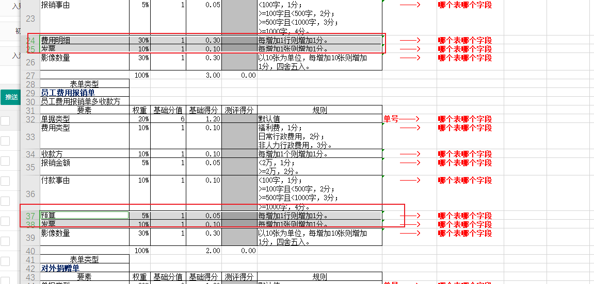
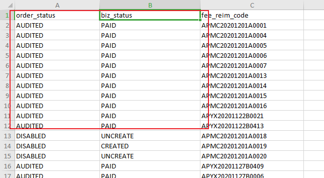
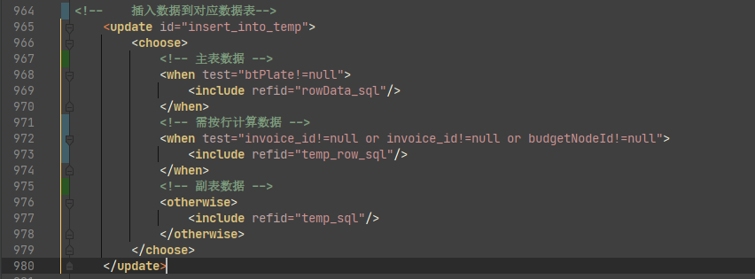

### 1. 已知问题一

各个单据涉及到`按行计分`的字段读取失效，包括

由于分表方案导致数据库结构发生变化，原有按行计分的字段计算方法失效：

解决方法：

更换按行计分的计算方法

### 2. 已知问题二

合同付款单副表（历史付款）导入问题：

有无历史付款需不需要判断 order_status,biz_status字段的状态

## Now

需要`按行计分`的插入t_temp_row

合同付款单：预算、发票

专项费用支出：预算、发票

对外捐赠：预算、发票

员工费用报销单：预算、发票

员工差旅报销单：费用明细、发票

**总：**预算、发票、费用明细

大概思路：

在主表、副表的基础上新增一个临时表`按行计分数据专表`。

该表不设置主键，直接无差别插入

### ￥￥

审批记录导入有问题

## 查找批量插入最佳条数

查看 MySQL max_allowed_packet MySQL 对SQL语句的大小限制

4194304 字节 = 4M

#### 计算一行字段占用的空间

表结构如下：

初略估算有 14 个字段 平均每个字段算 varchar(20) 那么一条数据最多占用

20*14 = 280 字节

所以在1M可以插入 (1024*1024)/52 = 3745 防止溢出可以算 3000 条

那么默认的 4M 可以插入 3000*4 = 12000条

参考资料 最优是在最大条数的一半 所以在默认4M的情况下最优是一次批量插入 6000条

发现在1000以上用时就基本稳定了。。