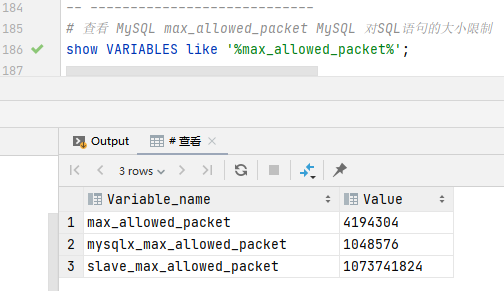
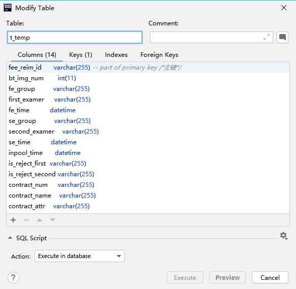

## 查找批量插入最佳条数

查看 MySQL max_allowed_packet MySQL 对SQL语句的大小限制

4194304 字节 = 4M

#### 计算一行字段占用的空间

表结构如下：

初略估算有 14 个字段 平均每个字段算 varchar(20) 那么一条数据最多占用

20*14 = 280 字节

所以在1M可以插入 (1024*1024)/52 = 3745 防止溢出可以算 3000 条

那么默认的 4M 可以插入 3000*4 = 12000条

参考资料 最优是在最大条数的一半 所以在默认4M的情况下最优是一次批量插入 6000条

发现在1000以上用时就基本稳定了。。