## 第二章

> 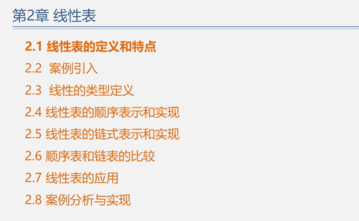

### 0. 知识回顾

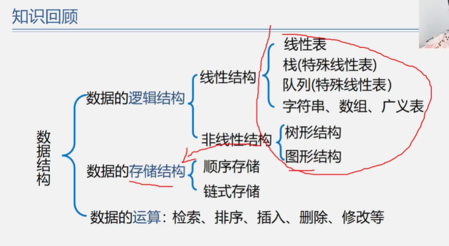

### 2.1. 线性表的定义和特点

`线性表`是具有相同特性的数据元素的一个有限序列。

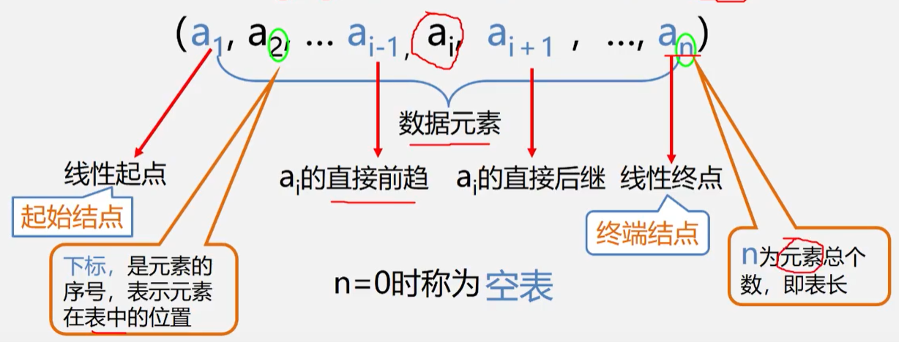

`线性表（Linear List）`:

由 $ n(n\geq)0 $个数据元素（结点）$a_1,a_2,...,a_n$ 组成的**有限序列**。

- 其中数据元素的个数 n 定义为表的`长度`。
- 当 $ n=0 $ 时称为`空表`。
- 将非空的线性表 $(n>0)$ 记作：$(a_1,a_2,...,a_n)$。
- 这里的数据元素 $a_i(1\leq i\leq n)$ 只是一个抽象的符号，其具体含义在不同的情况下可以不同。

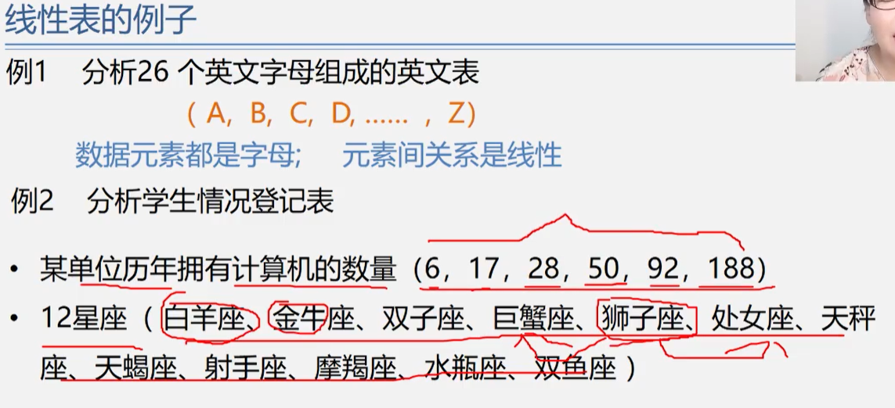

**线性表的逻辑特征**

从以上例子可看出线性表的逻辑特征：

- 在非空线性表中，有且仅有一个开始结点 $a_1$，它没有直接前趋，而仅有一个直接后继 $a_2$；
- 有且仅有一个终端结点 $a_n$，它没有直接后继，而仅有一个直接前趋 $a_n$。
- 其余的**内部结点** $a_i(2\leq i \leq n-1)$ 都有且仅有一个直接前趋 $a_{i-1} $ 和一个直接后继 $a_{i+1}$。

`线性表是一种典型的线性结构`


### 2.2 案例引入

#### 案例2.1 一元多项式的运算

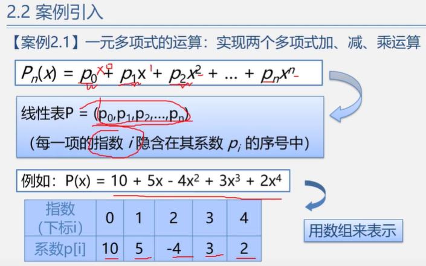

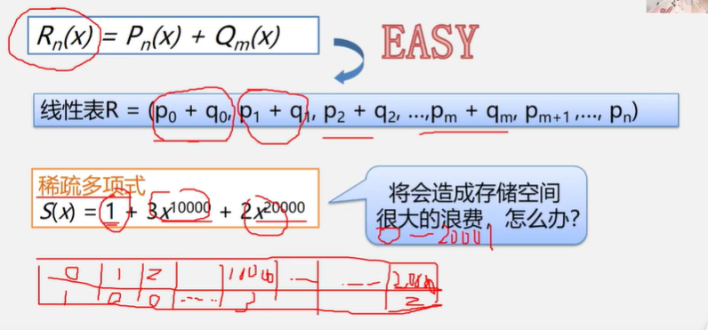

如果用上述方式，保存稀疏多项式时，将会造成存储空间很大的浪费，怎么办？

A：我们可以只保存指数不为 0 的项：

| 0    | 10000 | 20000 |
| ---- | ----- | ----- |
| 1    | 3     | 2     |

####  案例2.2 稀疏多项式的运算

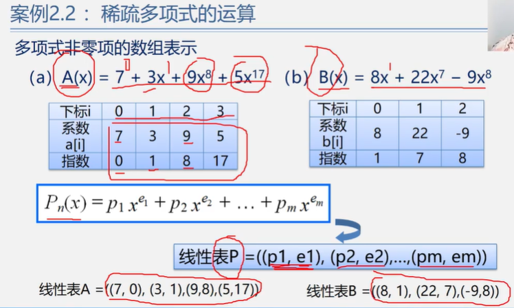


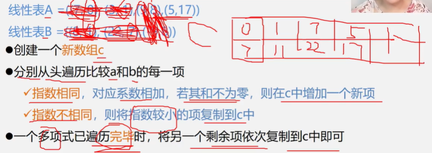

Q: 数组C多大合适？

A:大小是不定的。这就引入了顺序存储结构存在的问题。

**顺序存储结构存在的问题：**

- 存储空间分配不灵活
- 运算的空间复杂度高

可以使用链式存储结构：

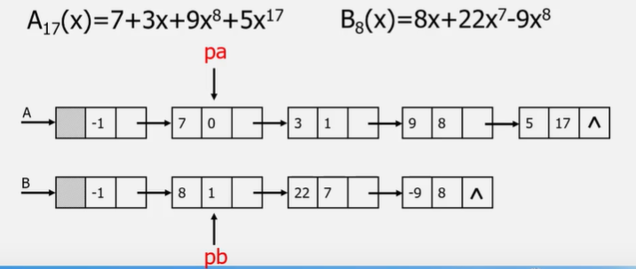

从头分别遍历两个链表，规则和上面一样。

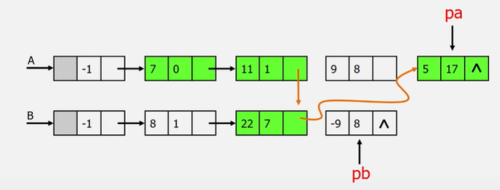

因此，求稀疏多项式时，可以使用链式存储结构。

#### 案例2.3 图书信息管理系统

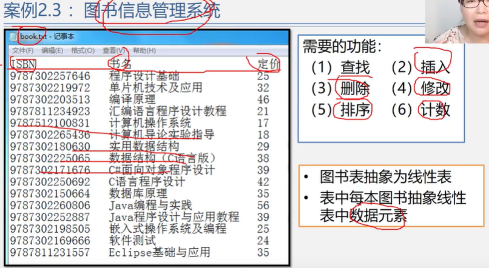

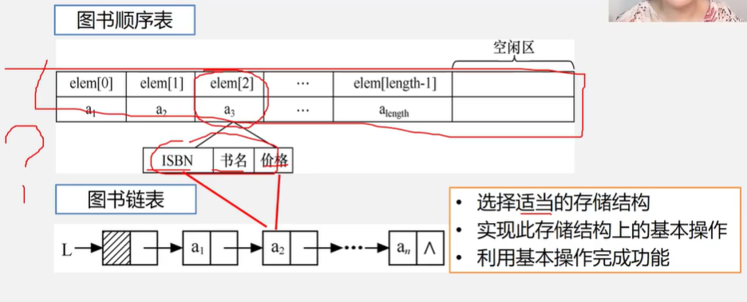

#### 案例总结

- 线性表中数据元素的类型可以为**简单类型**，也可以为**复杂类型**。
- 许多实际应用问题所涉的基本操作有很大相似性，不应为每个具体应用单独编写一个程序。
- 从具体应用中抽象出共性的 **逻辑结构**和**基本操作**（抽象数据类型），然后实现其 **存储结构**和 **基本操作**。


### 2.3 线性表的类型定义

抽象数据类型线性表的定义如下：

```c++
ADT List{
    数据对象：D = {a_i | a_i属于Elemset,(i=1,2,...,n,n>=0)}
    数据关系：R = {<a_{i-1},a_i> | a_{i-1},a_i属于D,(i=2,3,...,n)}
    基本操作：
        InitList(&L);
    	DestroyList(&L);
    	ListInsert(&L,i,e);
    	ListDelete(&L,i,&e);
    	....
}ADT List
```

其中 <a_{i-1},a_i> 是序偶关系，a_{i-1}是a_i的前趋，a_i是a_{i-1}的后继。

#### 基本操作：

- InitList(&L)
  - 操作结果：构造一个空的线性表L。
- DestroyList(&L)
  - 初始条件：线性表L已经存在
  - 操作结果：销毁线性表 L
- ClearList(&L)
  - 初始条件：线性表L已经存在
  - 操作结果：将线性表 L 重置为空表
- ListEmpty(L)
  - 初始条件：线性表L已经存在
  - 操作结果：若线性表 L 为空表，则返回 TRUE；否则返回 FALSE
- ListLength(L)
  - 初始条件：线性表L已经存在
  - 操作结果：返回线性表 L 中的数据元素个数
- GetElem(L,i,&e)
  - 初始条件：线性表L已经存在，1<=i<=ListLength(L)
  - 操作结果：用 e 返回线性表 L 中第 i 个数据元素的值
- LocalElem(L,e,compare())
  - 初始条件：线性表L已经存在,compare() 是数据元素判定函数
  - 操作结果：返回 L 中第 1 个与 e 满足 compare() 的数据元素的位序。若这样的数据元素不存在则返回值为 0
- PriorElem(L,cur_e,&pre_e)
  - 初始条件：线性表L已经存在
  - 操作结果：若 cur_e 是 L 的数据元素，且不是第一个，则用 pre_e 返回它的前趋，否则操作失败，pre_e 无意义
- NextElem(L,cur_e,&next_e)
  - 初始条件：线性表L已经存在
  - 操作结果：若 cur_e 是 L 的数据元素，且不是最后一个，则用 next_e 返回它的后继，否则操作失败，next_e 无意义
- ListInsert(&L,i,e)
  - 初始条件：线性表L已经存在,1<=i<=ListLength(L)+1
  - 操作结果：在 L 的第 i 个位置之前插入新的数据元素 e，L的长度加一
- ListDelete(&L,i,e)
  - 初始条件：线性表L已经存在,1<=i<=ListLength(L)+1
  - 操作结果：删除 L 的第 i 个数据元素 ，并用 e 返回其值，L的长度减一
- ListTraverse(&L,visied())
  - 初始条件：线性表L已经存在
  - 操作结果：依次对线性表中每个元素调用 visited()


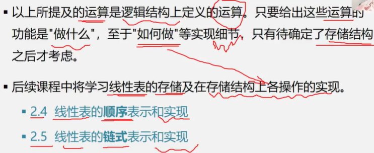