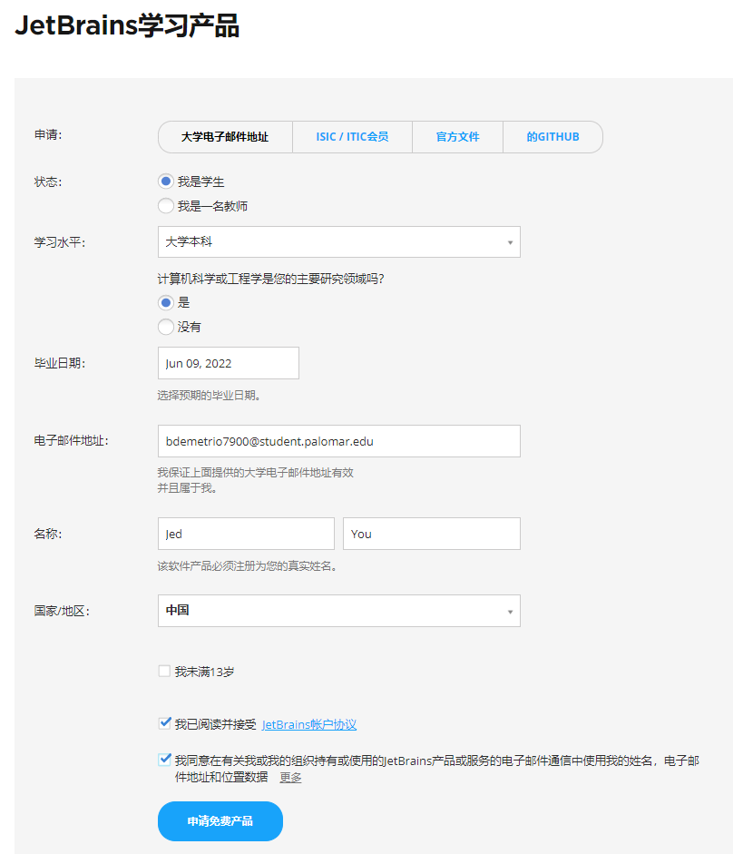
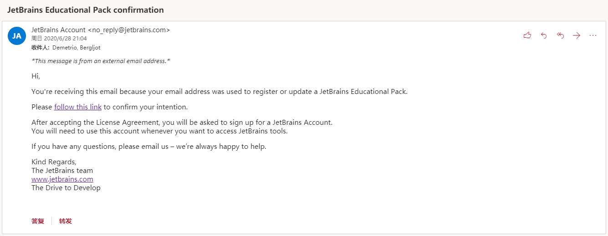
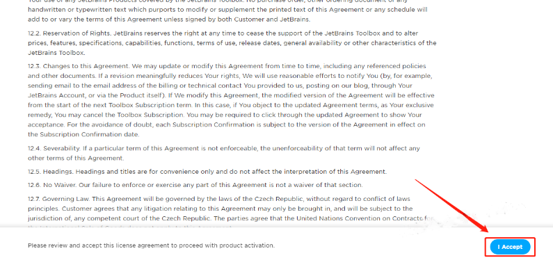
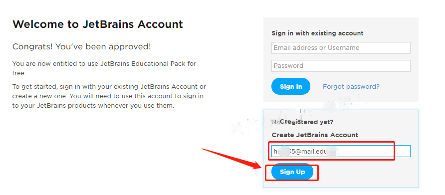
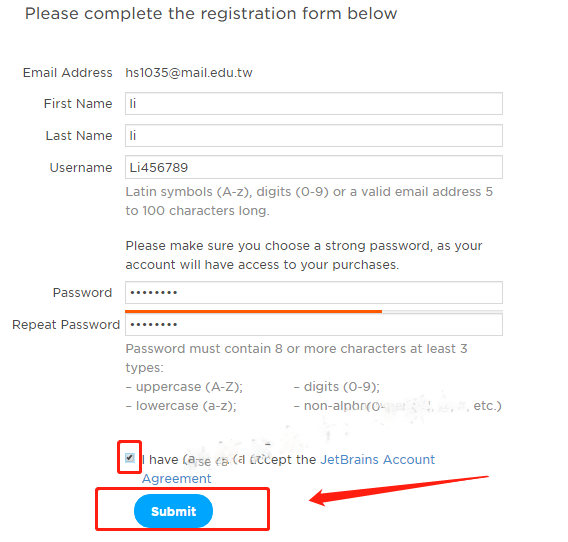
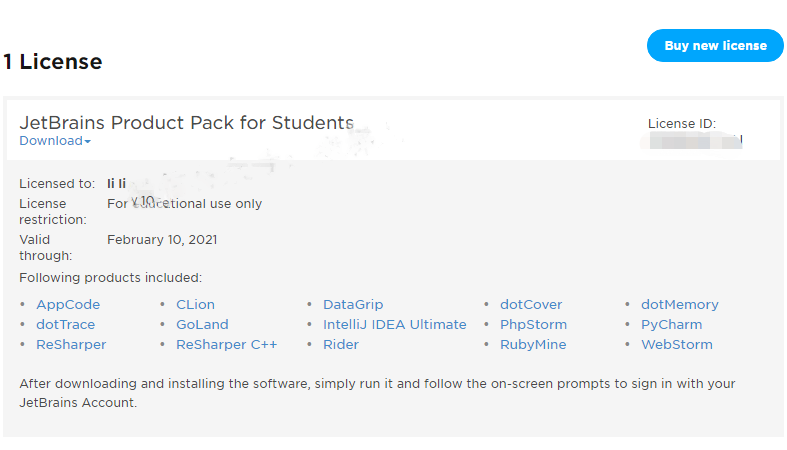
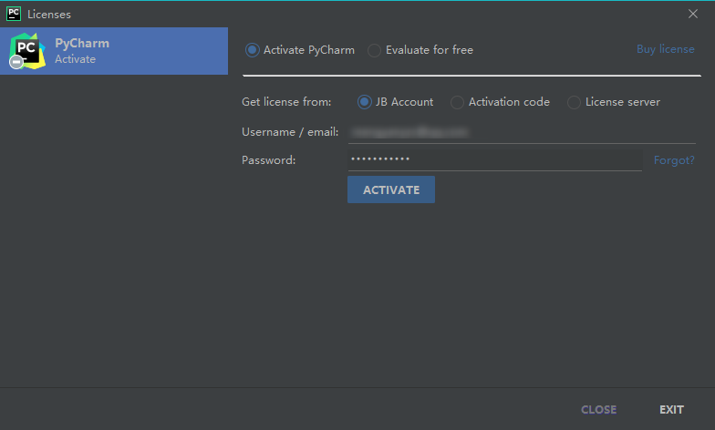
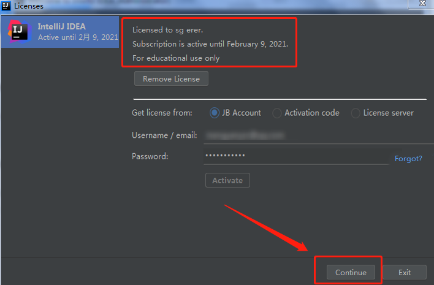

### 1.**1、打开官网：**[**https://www.jetbrains.com/student/**](https://www.jetbrains.com/student/)

**2、选择I'm a student，毕业日期、名字随便填写。填写教育邮箱地址，勾选接受许可协议，并点击 Apply for Free Products，如下图所示。**

**3、点击之后，你的教育邮箱会收到一封来自JetBrains官方的邮件。打开邮箱，可看到一封标题为“JetBrains Educational Pack Confirmation”的邮件，点击邮件中 【` follow this link`】 。若邮箱中没有，请在垃圾箱中查找。**

**4、点击【Confirm Request】后，会跳转到下图所示页面，滚动网页到最下方，点击 【I Accept】。**

**5、然后，在 Create JetBrains Account 下方输入邮箱，点击【Sign Up】去创建一个账户。有账号的话可以直接绑定**

**6、在下图所示页面中，输入姓名、用户名、密码，点击 【Submit】。**

**7、看到如下所示页面，即表明你已经申请成功。**

**8、在IDEA中激活窗口选择 JetBrains Account 激活，填写刚注册的账号以及密码，点【Activate】。**

**9、激活页面出现红色框中所示的提示，即表示已经激活成功，点击【Continue】即可进入软件，开始使用啦~**

