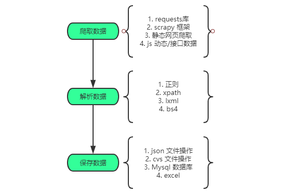

> 主要负责模块：
>
> - Hadoop 集群搭建
>
> - 数据采集

### 1. Hadoop 集群搭建

对于 Hadoop 集群搭建这部分，主要考到我们对 Hadoop集群及相关组件的搭建及配置。在这次 2020 大数据省赛中，主要考到了以下几个点：

1. Centos 7 下 Oracle JDK 的安装及环境变量的配置

2.  各个节点之间 ssh 免密钥的配置
3.  Hadoop 集群的搭建，几个重要配置文件的按要求配置
   - core-site.xml
   - hadoop-env.xml
   - hdfs-site.xml
4. Hadoop 集群的初始化与启动，及相关进程的启动

这一部分没有太多灵活的地方，只需要熟练掌握 Hadoop 的配置，多练习几遍集群的搭建，包括全分布式、伪分布式各种模式。对于 Linux 命令也要熟悉。

### 2. 数据采集

对于数据采集这一部分，本次大赛主要考到了 Python Scrapy 爬虫框架的使用，其中重点：

1. 对 Scrapy 框架的使用
2. xpath 解析的熟练使用
3. re 正则表达式的使用
4. 常见数据文件（json，cvs）的操作

经过这次比赛，作了下面这个图，其中每个点都应该重点掌握。

对于 scrapy 框架，不仅要掌握如何去爬取数据，对于 scrapy 框架的架构图也要熟悉，这能更加理解原理：

  

### 3. 总结

1. 在学习一个技能的时候，`系统化`的学习和`多实操`是最最最重要的

   scrapy 框架教程： https://www.bilibili.com/video/av76445640?from=search&seid=3618095070798988231 

2.  对于 Linux、Hadoop 的学习上，不仅要了解常用操作，更要学会 一些命令的帮助，因为 Linux 上很多命令都是有系统帮助的，能在我们忘记命令的时候起到很大的作用

3. 在 Python 编程中，除了常见的操作要熟悉之外，也要去了解如何去看它们的源码，只要引入库之后，按住 Ctrl 键就可以进入源码界面，里面有很多注释及说明。

4. 比赛的`赛事说明`及`样题` 很重要，比赛题目基本都是以此为依据，应该去仔细分析相应文件。